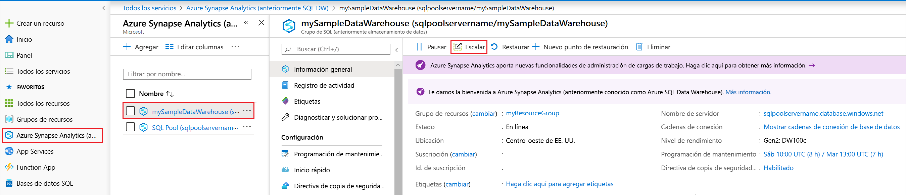
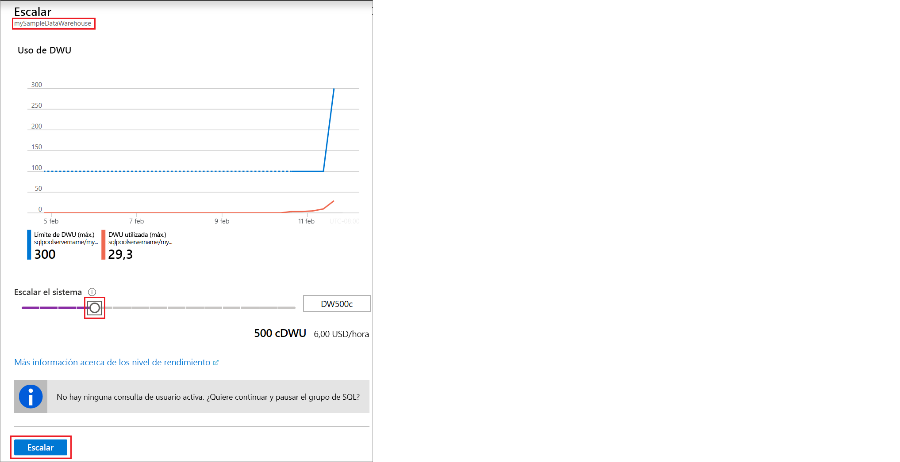

# Inicio rápido: Escalado del proceso del grupo de SQL de Synapse con Azure Portal

El proceso del grupo de SQL de Synapse (almacenamiento de datos) se puede escalar desde Azure Portal. [Escale horizontalmente un proceso](sql-data-warehouse-manage-compute-overview.md) para aumentar el rendimiento, o bien revierta la escalabilidad del proceso para ahorrar costos. 

Si no tiene una suscripción a Azure, cree una cuenta [gratuita](https://azure.microsoft.com/free/) antes de empezar.

## Inicio de sesión en Azure Portal

Inicie sesión en [Azure Portal](https://portal.azure.com/).

## Antes de empezar

Puede escalar un grupo de SQL que ya tenga, o bien usar el artículo [Inicio rápido: Creación y conexión (Azure Portal)](create-data-warehouse-portal.md) para crear un grupo de SQL llamado **mySampleDataWarehouse**. En esta guía de inicio rápido se escala **mySampleDataWarehouse**.

>[!IMPORTANT] 
>El grupo de SQL debe estar en línea para que se pueda escalar. 

## Escalado de proceso

Los recursos de proceso del grupo de SQL se pueden escalar mediante el aumento o la reducción de las unidades de almacenamiento de datos. En [Inicio rápido: Creación y consulta de un grupo de SQL de Synapse mediante Azure Portal](create-data-warehouse-portal.md) se creó **mySampleDataWarehouse** y se inicializó con 400 DWU. En los siguientes pasos se ajustan las DWU para **mySampleDataWarehouse**.

Para cambiar las unidades de almacenamiento de datos:

1. Haga clic en **Azure Synapse Analytics (formerly SQL DW)** a la izquierda de la página de Azure Portal.
2. Seleccione **mySampleDataWarehouse** en la página de **Azure Synapse Analytics (formerly SQL DW)** . Se abre el grupo de SQL.
3. Haga clic en **Escalar**.

    

2. En el panel Escalar, mueva el control deslizante hacia la izquierda o la derecha para cambiar el valor de DWU. A continuación, seleccione Escalar.

    

## Pasos siguientes
Para más información acerca del grupo de SQL, diríjase al tutorial [Carga de datos en un grupo de SQL](load-data-from-azure-blob-storage-using-polybase.md). 
