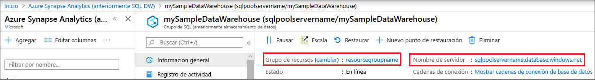

# <a name="quickstart-scale-compute-for-synapse-sql-pool-with-azure-powershell"></a>Inicio rápido: Escalado del proceso para grupos de SQL de Synapse con Azure PowerShell

Se puede escalar el proceso para grupos de SQL de Synapse (almacenamiento de datos) mediante Azure PowerShell. [Escale horizontalmente un proceso](sql-data-warehouse-manage-compute-overview.md) para aumentar el rendimiento, o bien revierta la escalabilidad del proceso para ahorrar costos.

Si no tiene una suscripción a Azure, cree una cuenta [gratuita](https://azure.microsoft.com/free/) antes de empezar.

## <a name="before-you-begin"></a>Antes de empezar

[!INCLUDE [updated-for-az](../../../includes/updated-for-az.md)]

En este inicio rápido se da por supuesto que ya tiene un grupo de SQL que puede escalar. Si tiene que crear uno, use el artículo sobre la [creación y conexión desde el portal](create-data-warehouse-portal.md) para crear un grupo de SQL llamado **mySampleDataWarehouse**.

## <a name="log-in-to-azure"></a>Inicio de sesión en Azure

Inicie sesión en la suscripción de Azure con el comando [Connect-AzAccount](/powershell/module/az.accounts/connect-azaccount?toc=/azure/synapse-analytics/sql-data-warehouse/toc.json&bc=/azure/synapse-analytics/sql-data-warehouse/breadcrumb/toc.json) y siga las instrucciones de la pantalla.

```powershell
Connect-AzAccount
```

Para ver qué suscripción está usando, ejecute [Get-AzSubscription](/powershell/module/az.accounts/get-azsubscription?toc=/azure/synapse-analytics/sql-data-warehouse/toc.json&bc=/azure/synapse-analytics/sql-data-warehouse/breadcrumb/toc.json).

```powershell
Get-AzSubscription
```

Si necesita usar una suscripción diferente de la predeterminada, ejecute [Set-AzContext](/powershell/module/az.accounts/set-azcontext?toc=/azure/synapse-analytics/sql-data-warehouse/toc.json&bc=/azure/synapse-analytics/sql-data-warehouse/breadcrumb/toc.json).

```powershell
Set-AzContext -SubscriptionName "MySubscription"
```

## <a name="look-up-data-warehouse-information"></a>Buscar información del almacenamiento de datos

Busque el nombre de la base de datos, el nombre del servidor y el grupo de recursos para el almacenamiento de datos que tiene previsto pausar y reanudar.

Siga estos pasos para buscar información de ubicación para el almacenamiento de datos.

1. Inicie sesión en [Azure Portal](https://portal.azure.com/).
2. Haga clic en **Azure Synapse Analytics (formerly SQL DW)** en la página de navegación izquierda de Azure Portal.
3. Seleccione **mySampleDataWarehouse** en la página de **Azure Synapse Analytics (formerly SQL DW)** para abrir el almacenamiento de datos.

    

4. Anote el nombre del almacenamiento de datos que se usará como nombre de la base de datos. Recuerda que un almacenamiento de datos es un tipo de base de datos. Además, anote el nombre del servidor y el grupo de recursos. Usará el nombre del servidor y el nombre del grupo de recursos en los comandos para pausar y reanudar.
5. Use solo la primera parte del nombre del servidor en los cmdlets de PowerShell. En la imagen anterior, el nombre completo del servidor es sqlpoolservername.database.windows.net. Se usará **sqlpoolservername** como nombre del servidor en el cmdlet de PowerShell.

## <a name="scale-compute"></a>Escalado de proceso

En el grupo de SQL, puede aumentar o reducir los recursos de procesos mediante el ajuste de las unidades del almacenamiento de datos. En [Guía de inicio rápido: Creación de una instancia de Azure SQL Data Warehouse en Azure Portal, y realización de consultas en ella](create-data-warehouse-portal.md) creó **mySampleDataWarehouse** y lo inició con 400 DWU. En los siguientes pasos se ajustan las DWU para **mySampleDataWarehouse**.

Para cambiar las unidades de almacenamiento de datos, use el cmdlet de PowerShell [Set-AzSqlDatabase](/powershell/module/az.sql/set-azsqldatabase?toc=/azure/synapse-analytics/sql-data-warehouse/toc.json&bc=/azure/synapse-analytics/sql-data-warehouse/breadcrumb/toc.json). En el ejemplo siguiente se establecen las unidades de almacenamiento de datos en DW300c para la base de datos **mySampleDataWarehouse**, que se hospeda en el grupo de recursos **resourcegroupname** del servidor **sqlpoolservername**.

```Powershell
Set-AzSqlDatabase -ResourceGroupName "resourcegroupname" -DatabaseName "mySampleDataWarehouse" -ServerName "sqlpoolservername" -RequestedServiceObjectiveName "DW300c"
```

## <a name="check-data-warehouse-state"></a>Comprobar el estado del almacenamiento de datos

Para ver el estado actual del almacenamiento de datos, use el cmdlet [Get-AzSqlDatabase](/powershell/module/az.sql/get-azsqldatabase?toc=/azure/synapse-analytics/sql-data-warehouse/toc.json&bc=/azure/synapse-analytics/sql-data-warehouse/breadcrumb/toc.json) de PowerShell. Este cmdlet muestra el estado de la base de datos **mySampleDataWarehouse** del grupo de recursos **resourcegroupname** y del servidor **sqlpoolservername.database.windows.net**.

```powershell
$database = Get-AzSqlDatabase -ResourceGroupName resourcegroupname -ServerName sqlpoolservername -DatabaseName mySampleDataWarehouse
```

El resultado será similar a este:

```powershell
ResourceGroupName             : resourcegroupname
ServerName                    : sqlpoolservername
DatabaseName                  : mySampleDataWarehouse
Location                      : North Europe
DatabaseId                    : 34d2ffb8-b70a-40b2-b4f9-b0a39833c974
Edition                       : DataWarehouse
CollationName                 : SQL_Latin1_General_CP1_CI_AS
CatalogCollation              :
MaxSizeBytes                  : 263882790666240
Status                        : Online
CreationDate                  : 11/20/2017 9:18:12 PM
CurrentServiceObjectiveId     : 284f1aff-fee7-4d3b-a211-5b8ebdd28fea
CurrentServiceObjectiveName   : DW300c
RequestedServiceObjectiveId   : 284f1aff-fee7-4d3b-a211-5b8ebdd28fea
RequestedServiceObjectiveName :
ElasticPoolName               :
EarliestRestoreDate           :
Tags                          :
ResourceId                    : /subscriptions/xxxxxxxx-xxxx-xxxx-xxxx-xxxxxxxxxxxx/
                                resourceGroups/resourcegroupname/providers/Microsoft.Sql/servers/sqlpoolservername/databases/mySampleDataWarehouse
CreateMode                    :
ReadScale                     : Disabled
ZoneRedundant                 : False
```

Puede comprobar el **Estado** de la base de datos en la salida. En este caso, puede ver esta base de datos está en línea.  Al ejecutar este comando, debería recibir uno de los siguientes valores de Estado: En línea, Pausando, Reanudando, Escalando o Pausado.

Para ver el estado del servicio, use el comando siguiente:

```powershell
$database | Select-Object DatabaseName,Status
```

## <a name="next-steps"></a>Pasos siguientes

Ya ha aprendido a escalar proceso del grupo de SQL. Para más información sobre el grupo de SQL, continúe con el tutorial sobre la carga de datos.

> [!div class="nextstepaction"]
>[Carga de datos en un grupo de SQL](load-data-from-azure-blob-storage-using-polybase.md)
