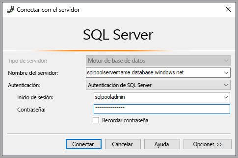
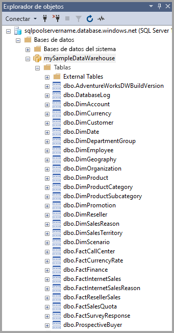
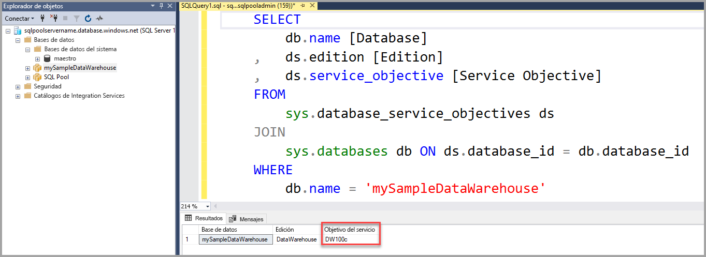
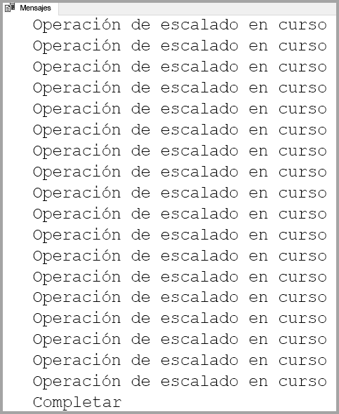

# <a name="quickstart-scale-compute-for-dedicated-sql-pool-formerly-sql-dw-in-azure-synapse-analytics-using-t-sql"></a>Inicio rápido: Escalado del proceso en un grupo de SQL dedicado (anteriormente SQL DW) en Azure Synapse Analytics mediante T-SQL

Escale un proceso en un grupo de SQL dedicado (anteriormente SQL DW) mediante T-SQL y SQL Server Management Studio (SSMS). [Escale horizontalmente un proceso](sql-data-warehouse-manage-compute-overview.md) para aumentar el rendimiento, o bien revierta la escalabilidad del proceso para ahorrar costos.

Si no tiene una suscripción a Azure, cree una cuenta [gratuita](https://azure.microsoft.com/free/) antes de empezar.

## <a name="before-you-begin"></a>Antes de empezar

Descargue e instale la versión más reciente de [SQL Server Management Studio](/sql/ssms/download-sql-server-management-studio-ssms?toc=/azure/synapse-analytics/sql-data-warehouse/toc.json&bc=/azure/synapse-analytics/sql-data-warehouse/breadcrumb/toc.json&view=azure-sqldw-latest) (SSMS).

## <a name="create-a-dedicated-sql-pool-formerly-sql-dw"></a>Creación de un grupo de SQL dedicado (anteriormente SQL DW)

Use [Inicio rápido: Creación y conexión: Azure Portal](create-data-warehouse-portal.md) para crear un grupo de SQL dedicado (anteriormente almacenamiento de datos denominado SQL DW) llamado **mySampleDataWarehouse**. Complete el inicio rápido para asegurarse de que dispone de una regla de firewall y que puede conectarse a un grupo de SQL dedicado (anteriormente SQL DW) desde SQL Server Management Studio.

## <a name="connect-to-the-server-as-server-admin"></a>Conexión al servidor como administrador del mismo

En esta sección se usa [SQL Server Management Studio](/sql/ssms/download-sql-server-management-studio-ssms?toc=/azure/synapse-analytics/sql-data-warehouse/toc.json&bc=/azure/synapse-analytics/sql-data-warehouse/breadcrumb/toc.json&view=azure-sqldw-latest) (SSMS) para establecer una conexión con el servidor Azure SQL.

1. Abra SQL Server Management Studio.

2. En el cuadro de diálogo **Conectar con el servidor**, especifique la siguiente información:

   | Configuración       | Valor sugerido | Descripción |
   | ------------ | ------------------ | ------------------------------------------------- |
   | Tipo de servidor | Motor de base de datos | Este valor es obligatorio |
   | Nombre de servidor | Nombre completo del servidor | Este es un ejemplo: **mySampleDataWarehouseservername.database.windows.net**. |
   | Authentication | Autenticación de SQL Server | Autenticación de SQL es el único tipo de autenticación que se ha configurado en este tutorial. |
   | Inicio de sesión | La cuenta de administrador del servidor | Es la cuenta que especificó cuando creó el servidor. |
   | Contraseña | La contraseña de la cuenta de administrador del servidor | Es la contraseña que especificó cuando creó el servidor. |

    

3. Haga clic en **Conectar**. La ventana Explorador de objetos se abre en SSMS.

4. En el Explorador de objetos, expanda **Bases de datos**. Después, expanda **mySampleDataWarehouse** para ver los objetos de la nueva base de datos.

    

## <a name="view-service-objective"></a>Visualización del objetivo del servicio

El valor del objetivo del servicio contiene el número de unidades del almacenamiento de datos para el grupo de SQL dedicado (anteriormente SQL DW).

Para ver las actuales unidades de almacenamiento de datos de un grupo de SQL dedicado (anteriormente SQL DW):

1. En la conexión a **mySampleDataWarehouseservername.database.windows.net**, expanda **Bases de datos del sistema**.
2. Haga clic con el botón derecho en **maestra** y luego seleccione **Nueva consulta**. Se abrirá una nueva ventana de consulta.
3. Ejecute la consulta siguiente para realizar la selección desde la vista de administración dinámica sys.database_service_objectives.

    ```sql
    SELECT
        db.name [Database]
    ,    ds.edition [Edition]
    ,    ds.service_objective [Service Objective]
    FROM
         sys.database_service_objectives ds
    JOIN
        sys.databases db ON ds.database_id = db.database_id
    WHERE
        db.name = 'mySampleDataWarehouse'
    ```

4. Los siguientes resultados muestran que **mySampleDataWarehouse** tiene un objetivo del servicio de DW400.

    

## <a name="scale-compute"></a>Escalado de proceso

En un grupo de SQL dedicado (anteriormente SQL DW), se pueden aumentar o disminuir los recursos de procesos mediante el ajuste de las unidades de almacenamiento de datos. En [Guía de inicio rápido: Creación de una instancia de Azure SQL Data Warehouse en Azure Portal, y realización de consultas en ella](create-data-warehouse-portal.md) creó **mySampleDataWarehouse** y lo inició con 400 DWU. En los siguientes pasos se ajustan las DWU para **mySampleDataWarehouse**.

Para cambiar las unidades de almacenamiento de datos:

1. Haga clic con el botón derecho en **maestra** y luego seleccione **Nueva consulta**.
2. Use la instrucción T-SQL [ALTER DATABASE](/sql/t-sql/statements/alter-database-azure-sql-database?toc=/azure/synapse-analytics/sql-data-warehouse/toc.json&bc=/azure/synapse-analytics/sql-data-warehouse/breadcrumb/toc.json&view=azure-sqldw-latest) para modificar el objetivo del servicio. Ejecute la consulta siguiente para cambiar el objetivo del servicio por DW300.

    ```Sql
    ALTER DATABASE mySampleDataWarehouse
    MODIFY (SERVICE_OBJECTIVE = 'DW300c');
    ```

## <a name="monitor-scale-change-request"></a>Supervisión de la solicitud de cambio de escalado

Para ver el progreso de la solicitud de cambio anterior, puede usar la sintaxis de T-SQL `WAITFORDELAY` para sondear la vista de administración dinámica (DMV) de sys.dm_operation_status.

Para sondear el estado de cambio del objeto de servicio:

1. Haga clic con el botón derecho en **maestra** y luego seleccione **Nueva consulta**.
2. Ejecute la siguiente consulta para sondear la vista de administración dinámica de sys.dm_operation_status.

    ```sql
    WHILE
    (
        SELECT TOP 1 state_desc
        FROM sys.dm_operation_status
        WHERE
            1=1
            AND resource_type_desc = 'Database'
            AND major_resource_id = 'mySampleDataWarehouse'
            AND operation = 'ALTER DATABASE'
        ORDER BY
            start_time DESC
    ) = 'IN_PROGRESS'
    BEGIN
        RAISERROR('Scale operation in progress',0,0) WITH NOWAIT;
        WAITFOR DELAY '00:00:05';
    END
    PRINT 'Complete';
    ```

3. La salida resultante muestra un registro del sondeo del estado.

    

## <a name="check-dedicated-sql-pool-formerly-sql-dw-state"></a>Comprobación del estado de un grupo de SQL dedicado (anteriormente SQL DW)

Cuando un grupo de SQL dedicado (anteriormente SQL DW) está en pausa, no es posible conectarse a él con T-SQL. Para ver el estado actual del grupo de SQL dedicado (anteriormente SQL DW), se puede usar un cmdlet de PowerShell. Para obtener un ejemplo, vea [Comprobación del estado de un grupo de SQL dedicado (anteriormente SQL DW): PowerShell](quickstart-scale-compute-powershell.md#check-data-warehouse-state).

## <a name="check-operation-status"></a>Comprobación del estado de la operación

Para devolver información sobre varias operaciones de administración de un grupo de SQL dedicado (anteriormente SQL DW), ejecute la siguiente consulta en la vista de administración dinámica [sys.dm_operation_status](/sql/relational-databases/system-dynamic-management-views/sys-dm-operation-status-azure-sql-database?toc=/azure/synapse-analytics/sql-data-warehouse/toc.json&bc=/azure/synapse-analytics/sql-data-warehouse/breadcrumb/toc.json&view=azure-sqldw-latest). Por ejemplo, devuelve la operación y su estado, que será IN_PROGRESS o COMPLETED.

```sql
SELECT *
FROM
    sys.dm_operation_status
WHERE
    resource_type_desc = 'Database'
AND
    major_resource_id = 'mySampleDataWarehouse'
```

## <a name="next-steps"></a>Pasos siguientes

Ya ha aprendido a escalar el proceso de un grupo de SQL dedicado (anteriormente SQL DW). Para más información sobre Azure Synapse, pase al tutorial en el que se indica cómo cargar datos.

> [!div class="nextstepaction"]
>[Carga de datos en un grupo de SQL dedicado](load-data-from-azure-blob-storage-using-polybase.md)
