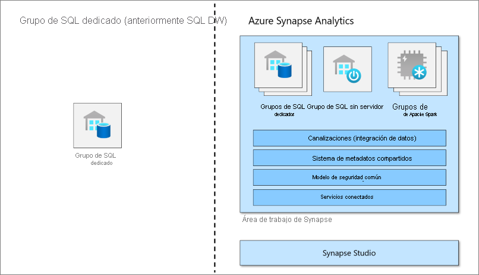

# ¿Qué es un grupo de SQL dedicado (anteriormente SQL DW) en Azure Synapse Analytics?

Azure Synapse Analytics es un servicio de análisis que engloba el almacenamiento de datos empresariales y el análisis de macrodatos. Un grupo de SQL dedicado (anteriormente SQL DW) hace referencia a las características de almacenamiento de datos empresariales que están disponibles en Azure Synapse Analytics.

Un grupo de SQL dedicado (anteriormente SQL DW) representa una colección de recursos de análisis que se aprovisionan al usar Synapse SQL. El tamaño de un grupo de SQL dedicado (anteriormente SQL DW) se determina mediante las unidades de almacenamiento de datos (DWU).

Una vez que se crea un grupo de SQL dedicado, puede importar macrodatos con consultas T-SQL de [PolyBase](/sql/relational-databases/polybase/polybase-guide?toc=/azure/synapse-analytics/sql-data-warehouse/toc.json&bc=/azure/synapse-analytics/sql-data-warehouse/breadcrumb/toc.json&view=azure-sqldw-latest) simples y, después, usar la potencia del motor de consultas distribuidas para realizar un análisis de alto rendimiento. Al realizar la integración y el análisis de los datos, el grupo de SQL dedicado (anteriormente SQL DW) pasará a ser la versión única de certeza con la que puede contar su empresa para obtener información.

> [!NOTE]
>Explore la [documentación de Azure Synapse Analytics](../overview-what-is.md).
> 

## Componente clave de una solución de macrodatos

El almacenamiento de datos un componente clave de una solución de macrodatos de un extremo a otro en la nube.

En una solución de datos en la nube, los datos provenientes de varios orígenes se ingieren en almacenes de macrodatos. Una vez que están en un almacén de macrodatos, Hadoop, y Spark y los algoritmos de aprendizaje automático preparan y entrenan los datos. Cuando los datos están listos para el análisis complejo, el grupo de SQL dedicado usa PolyBase para consultar los almacenes de macrodatos. PolyBase usa las consultas T-SQL estándar para llevar los datos a tablas del grupo de SQL dedicado (anteriormente SQL DW).

El grupo de SQL dedicado (anteriormente SQL DW) almacena los datos en tablas relacionales con almacenamiento en columnas. Este formato reduce considerablemente los costos de almacenamiento de datos y mejora el rendimiento de las consultas. Una vez que los datos están almacenados, se pueden realizar análisis a gran escala. En comparación con los sistemas de bases de datos tradicionales, las consultas de análisis finalizan en segundos, en lugar de minutos, o en horas, en lugar de días.

Los resultados del análisis pueden ir a aplicaciones o bases de datos de informes mundiales. En ellas, los analistas empresariales pueden obtener información útil para tomar decisiones empresariales bien informadas.

## Pasos siguientes

- Exploración de la [arquitectura de Azure Synapse](massively-parallel-processing-mpp-architecture.md)
- [Creación de un grupo de SQL dedicado](create-data-warehouse-portal.md) de forma rápida
- [Cargue datos de ejemplo](load-data-from-azure-blob-storage-using-polybase.md).
- Explore [vídeos](https://azure.microsoft.com/documentation/videos/index/?services=sql-data-warehouse).

O bien, examine algunos de estos otros recursos de Azure Synapse.

- Busque información en [Blogs](https://azure.microsoft.com/blog/tag/azure-sql-data-warehouse/).
- Envíe una [solicitud de característica](https://feedback.azure.com/forums/307516-sql-data-warehouse).
- [Creación de una incidencia de soporte técnico](sql-data-warehouse-get-started-create-support-ticket.md)
- Buscar en la [página de preguntas y respuestas de Microsoft](https://docs.microsoft.com/answers/topics/azure-synapse-analytics.html)
- Busque en el [foro Stack Overflow](https://stackoverflow.com/questions/tagged/azure-sqldw).
