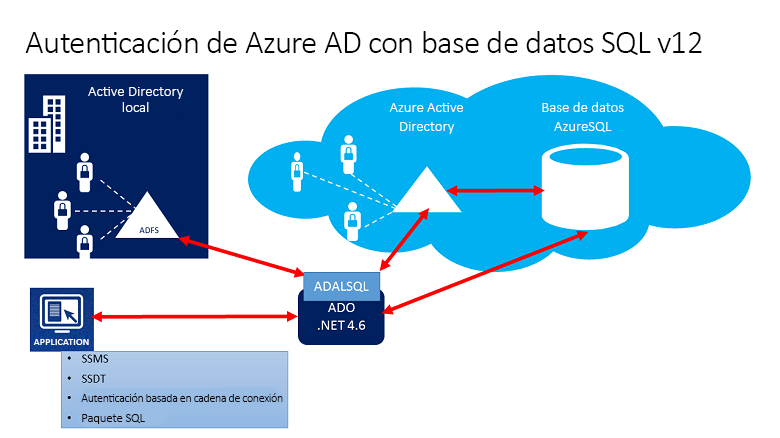
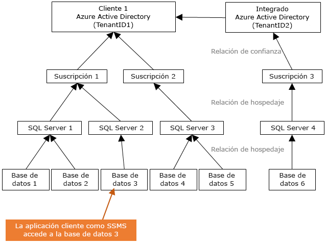
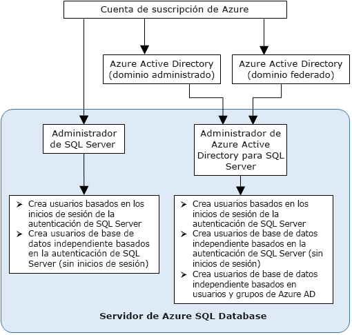

# Uso de la autenticación de Azure Active Directory para autenticación con Synapse SQL

La autenticación de Azure Active Directory es un mecanismo que permite conectar con [Azure Synapse Analytics](../overview-faq.md) mediante identidades de Azure Active Directory (Azure AD).

Con la autenticación de Azure AD, puede administrar de forma centralizada las identidades de usuario que tienen acceso a Azure Synapse para simplificar la administración de permisos. Entre las ventajas se incluyen las siguientes:

- Proporciona una alternativa a la autenticación normal con nombre de usuario y contraseña.
- Ayuda a detener la proliferación de identidades de usuario en los servidores de base de datos.
- Permite la rotación de contraseñas en un solo lugar.
- Los clientes pueden administrar los permisos mediante grupos externos (Azure AD).
- Puede eliminar el almacenamiento de contraseñas mediante la habilitación de la autenticación integrada de Windows y otras formas de autenticación compatibles con Azure Active Directory.
- Azure AD admite la autenticación basada en tokens para las aplicaciones que se conectan a Azure Synapse.
- La autenticación de Azure AD es compatible con ADFS (federación de dominio) o la autenticación nativa de usuario y contraseña para una instancia de Azure Active Directory local sin sincronización de dominios.
- Azure AD admite conexiones de SQL Server Management Studio que usan la autenticación universal de Active Directory, lo cual incluye Multi-Factor Authentication (MFA).  MFA incluye una sólida autenticación con una gama de sencillas opciones de comprobación: llamada de teléfono, mensaje de texto, tarjetas inteligentes con PIN o notificación de aplicación móvil. Para más información, consulte [Compatibilidad de SSMS para la autenticación multifactor de Azure AD con Synapse SQL](mfa-authentication.md).
- Azure AD admite conexiones similares desde SQL Server Data Tools (SSDT) que usan la autenticación interactiva de Active Directory. Para más información, consulte [Compatibilidad de Azure Active Directory con SQL Server Data Tools (SSDT)](/sql/ssdt/azure-active-directory?toc=/azure/synapse-analytics/toc.json&bc=/azure/synapse-analytics/breadcrumb/toc.json&view=azure-sqldw-latest).

En los pasos de configuración se incluyen los siguientes procedimientos para configurar y usar la autenticación de Azure Active Directory.

1. Cree y rellene una instancia de Azure AD.
2. Creación de una identidad de Azure Active Directory
3. Asignación de un rol para crear una identidad de Azure Active Directory en el área de trabajo de Synapse (versión preliminar)
4. Conexión a Synapse Studio mediante identidades de Azure AD.

## Paso a través de AAD en Azure Synapse Analytics

Azure Synapse Analytics le permite acceder a los datos del lago de datos mediante su identidad de Azure Active Directory.

La definición de los derechos de acceso a los archivos y datos que se admiten en diferentes motores de datos permite simplificar las soluciones de lago de datos mediante el uso de un único lugar en el que se definen los permisos en lugar de tener que definirlos en varios lugares.

## Arquitectura de confianza

En el siguiente diagrama de alto nivel se resume la arquitectura de la solución que conlleva el uso de la autenticación de Azure AD con Synapse SQL. Para admitir la contraseña de usuario nativa de Azure AD, se considera solo la parte de la nube y Azure AD o Synapse SQL. Para admitir la autenticación federada (o el usuario o contraseña para las credenciales de Windows), se requiere la comunicación con el bloque ADFS. Las flechas indican las rutas de comunicación.

En el diagrama siguiente se indica la federación, la confianza y las relaciones de hospedaje que permiten que un cliente se conecte a una base de datos mediante el envío de un token que una instancia de Azure AD autenticó y que es de confianza para la base de datos. 

El cliente 1 puede representar una instancia de Azure Active Directory con usuarios nativos o una instancia de AD con usuarios federados. El cliente 2 representa una posible solución, incluidos los usuarios importados; en este ejemplo proceden de una instancia de Azure Active Directory federada con ADFS sincronizado con Azure Active Directory. 

Es importante comprender que el acceso a una base de datos mediante la autenticación de Azure AD requiere que la suscripción de hospedaje esté asociada a Azure AD. Debe utilizarse la misma suscripción para crear el servidor de SQL Server que hospeda la instancia de Azure SQL Database o el grupo de SQL.

## Estructura del administrador

Cuando se usa la autenticación de Azure AD, existen dos cuentas de administrador para Synapse SQL: el administrador del servidor de SQL Server original y el administrador de Azure AD. Solo el administrador basado en una cuenta de Azure AD puede crear el primer usuario de base de datos independiente en Azure AD en una base de datos de usuario. 

El inicio de sesión del administrador de Azure AD puede ser un usuario de Azure AD o un grupo de Azure AD. Cuando el administrador es una cuenta de grupo, cualquier miembro del grupo lo puede usar, lo que permite varios administradores de Azure AD para la instancia de Synapse SQL. 

Mediante el uso de la cuenta de grupo como un administrador, se mejora la administración al permitir agregar y quitar miembros de grupo de forma centralizada en Azure AD sin cambiar los usuarios ni los permisos del área de trabajo de Synapse Analytics. Solo un administrador de Azure AD (un usuario o grupo) se puede configurar en cualquier momento.

## Permisos

Para crear nuevos usuarios, debe tener el permiso `ALTER ANY USER` en la base de datos. El permiso `ALTER ANY USER` se puede conceder a cualquier usuario de la base de datos. Las cuentas de administrador del servidor también disponen del permiso `ALTER ANY USER`, así como los usuarios de la base de datos con los permisos `CONTROL ON DATABASE` o `ALTER ON DATABASE` para esa base de datos y los miembros del rol de la base de datos `db_owner`.

Para crear un usuario de base de datos independiente en Synapse SQL, debe conectarse a la base de datos o instancia con una identidad de Azure AD. Para crear el primer usuario de base de datos independiente , debe conectarse a la base de datos con un administrador de Azure AD (que es el propietario de la base de datos). 

La autenticación de Azure AD solo es posible si se creó el administrador de Azure AD para Synapse SQL. Si se ha quitado el administrador de Azure Active Directory desde el servidor, los usuarios de Azure Active Directory creados previamente en Synapse SQL ya no podrán conectarse a la base de datos con sus credenciales de Azure Active Directory.
 
## Características y limitaciones de Azure AD

- Los siguientes miembros de Azure AD se pueden aprovisionar en Synapse SQL:

  - Miembros nativos: un miembro creado en Azure AD en el dominio administrado o en un dominio personalizado. Para más información, consulte [Incorporación de su nombre de dominio personalizado a Azure Active Directory](../../active-directory/fundamentals/add-custom-domain.md?toc=/azure/synapse-analytics/toc.json&bc=/azure/synapse-analytics/breadcrumb/toc.json).
  - Miembros del dominio federado: un miembro creado en Azure AD con un dominio federado. Para más información, consulte [Microsoft Azure now supports federation with Windows Server Active Directory](https://azure.microsoft.com/blog/20../../windows-azure-now-supports-federation-with-windows-server-active-directory/)(Microsoft Azure ya admite la federación con Windows Server Active Directory).
  - Miembros importados de otros directorios de Azure AD que son miembros nativos o miembros de dominio federado.
  - Grupos de Active Directory creados como grupos de seguridad.

- Los usuarios de Azure AD que forman parte de un grupo que tiene el rol de servidor `db_owner` no pueden usar la sintaxis **[CREATE DATABASE SCOPED CREDENTIAL](/sql/t-sql/statements/create-database-scoped-credential-transact-sql?toc=/azure/synapse-analytics/toc.json&bc=/azure/synapse-analytics/breadcrumb/toc.json&view=azure-sqldw-latest)** en Synapse SQL. Verá este error:

    `SQL Error [2760] [S0001]: The specified schema name 'user@mydomain.com' either does not exist or you do not have permission to use it.`

    Conceda el rol `db_owner` directamente al usuario de Azure AD para mitigar el problema de **CREATE DATABASE SCOPED CREDENTIAL**.

- Estas funciones del sistema devuelven valores NULL cuando se ejecutan en las entidades de seguridad de Azure AD:

  - `SUSER_ID()`
  - `SUSER_NAME(<admin ID>)`
  - `SUSER_SNAME(<admin SID>)`
  - `SUSER_ID(<admin name>)`
  - `SUSER_SID(<admin name>)`

## Conexión mediante identidades de Azure AD

La autenticación de Azure Active Directory admite los siguientes métodos de conexión a una base de datos mediante identidades de Azure AD:

- Contraseña de Azure Active Directory
- Azure Active Directory integrado
- Azure Active Directory Universal con MFA
- Mediante la autenticación de token de aplicación

Se admiten los siguientes métodos de autenticación para entidades de seguridad (inicios de sesión) de un servidor de Azure AD (**versión preliminar pública**):

- Contraseña de Azure Active Directory
- Azure Active Directory integrado
- Azure Active Directory Universal con MFA

### Consideraciones adicionales

- Para mejorar la capacidad de administración, se recomienda que aprovisione un grupo dedicado de Azure AD como administrador.
- Solo un administrador de Azure AD (un usuario o grupo) se puede configurar para un grupo de Synapse SQL en cualquier momento.
  - La adición de entidades de seguridad (inicios de sesión) de un servidor de Azure AD para SQL a petición (versión preliminar) ofrece la posibilidad de crear varias de estas entidades que se pueden agregar al rol `sysadmin`.
- Inicialmente, solo un administrador de Azure AD para Synapse SQL puede conectarse a este con una cuenta de Azure Active Directory. El administrador de Active Directory puede configurar los usuarios de la base de datos de Azure AD sucesivos.
- Se recomienda establecer el tiempo de espera de conexión a 30 segundos.
- SQL Server 2016 Management Studio y SQL Server Data Tools para Visual Studio 2015 (versión 14.0.60311.1 abril de 2016 o posterior) admiten la autenticación de Azure Active Directory. (La autenticación de Azure AD es compatible con el **proveedor de datos .NET Framework para SqlServer**; al menos la versión 4.6 de .NET Framework). Por lo tanto, las versiones más recientes de estas herramientas y aplicaciones de capa de datos (DAC y .BACPAC) pueden usar la autenticación de Azure AD.
- A partir de la versión 15.0.1, la [utilidad sqlcmd](/sql/tools/sqlcmd-utility?toc=/azure/synapse-analytics/toc.json&bc=/azure/synapse-analytics/breadcrumb/toc.json&view=azure-sqldw-latest) y la [utilidad bcp](/sql/tools/bcp-utility?toc=/azure/synapse-analytics/toc.json&bc=/azure/synapse-analytics/breadcrumb/toc.json&view=azure-sqldw-latest) admiten la autenticación interactiva de Active Directory con MFA.
- SQL Server Data Tools para Visual Studio 2015 requiere al menos la versión de abril de 2016 de Data Tools (versión 14.0.60311.1). Actualmente, los usuarios de Azure AD no se muestran en el explorador de objetos de SSDT. Como solución alternativa, vea los usuarios de [sys.database_principals](/sql/relational-databases/system-catalog-views/sys-database-principals-transact-sql?toc=/azure/synapse-analytics/toc.json&bc=/azure/synapse-analytics/breadcrumb/toc.json&view=azure-sqldw-latest).
- [Microsoft JDBC Driver 6.0 para SQL Server](https://www.microsoft.com/download/details.aspx?id=11774) es compatible con la autenticación de Azure AD. Consulte también [Configurar las propiedades de conexión](/sql/connect/jdbc/setting-the-connection-properties?toc=/azure/synapse-analytics/toc.json&bc=/azure/synapse-analytics/breadcrumb/toc.json&view=azure-sqldw-latest).

## Pasos siguientes

- Para obtener información general sobre el acceso y el control en Synapse SQL, consulte [Control de acceso de Synapse SQL](../sql/access-control.md).
- Para más información acerca de las entidades de seguridad de bases de datos, consulte [Entidades de seguridad](/sql/relational-databases/security/authentication-access/principals-database-engine?toc=/azure/synapse-analytics/toc.json&bc=/azure/synapse-analytics/breadcrumb/toc.json&view=azure-sqldw-latest).
- Para más información acerca de los roles de base de datos, consulte [Roles de nivel de base de datos](/sql/relational-databases/security/authentication-access/database-level-roles?toc=/azure/synapse-analytics/toc.json&bc=/azure/synapse-analytics/breadcrumb/toc.json&view=azure-sqldw-latest).

 