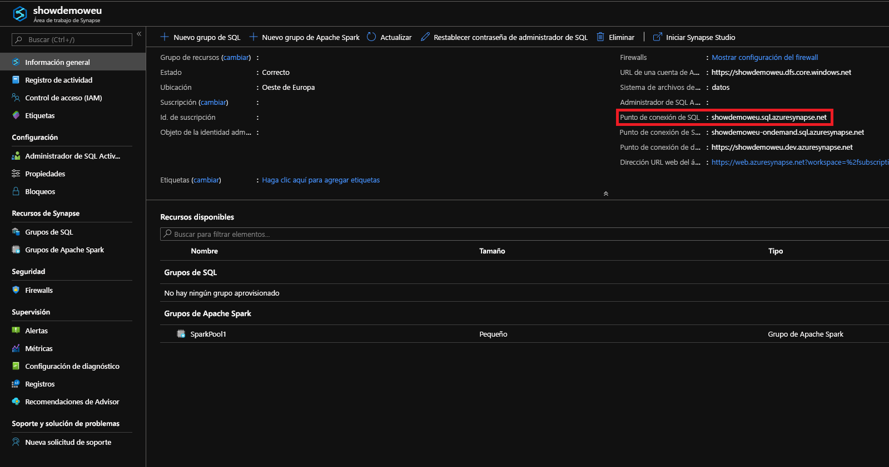
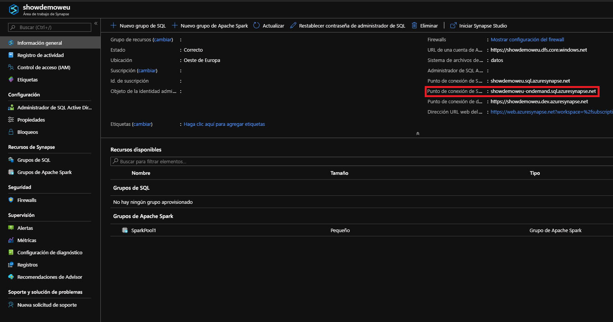

# <a name="connect-to-synapse-sql"></a>Conexión a Synapse SQL
Conéctese a la funcionalidad de Synapse SQL en Azure Synapse Analytics.

## <a name="supported-tools-for-serverless-sql-pool"></a>Herramientas admitidas en el grupo de SQL sin servidor

[Azure Data Studio](/sql/azure-data-studio/download-azure-data-studio) es totalmente compatible a partir de la versión 1.18.0. SSMS es parcialmente compatible a partir de la versión 18.5, que solo se puede usar para establecer conexión y realizar consultas.

> [!NOTE]
> Si el inicio de sesión de AAD tiene una conexión abierta durante más de una hora en el momento de la ejecución de la consulta, se producirá un error en todas las consultas que usen AAD, lo que incluye la realización de consultas en el almacenamiento mediante el paso a través de AAD y las instrucciones que interactúan con AAD (como CREATE EXTERNAL PROVIDER). Esto afecta a todas las herramientas que mantienen las conexiones abiertas, como en el editor de consultas de SSMS y ADS. Las herramientas que abren conexiones nuevas para ejecutar una consulta, como Synapse Studio, no resultan afectadas.

> Para mitigar este problema, puede reiniciar SSMS, o bien conectarse y desconectarse en ADS. 

## <a name="find-your-server-name"></a>Búsqueda del nombre de servidor

El nombre de servidor del grupo de SQL dedicado en el siguiente ejemplo es showdemoweu.sql.azuresynapse.net.
El nombre de servidor del grupo de SQL sin servidor en el siguiente ejemplo es showdemoweu.sql.azuresynapse.net.

Para buscar el nombre del servidor completo:

1. Vaya a [Azure Portal](https://portal.azure.com).
2. Seleccione **Áreas de trabajo de Synapse**.
3. Seleccione el área de trabajo a la que desea conectarse.
4. Vaya a la información general.
5. Busque el nombre del servidor completo:

## <a name="sql-pool"></a>**Grupo de SQL**



## <a name="serverless-sql-pool"></a>**Grupo de SQL sin servidor**



## <a name="supported-drivers-and-connection-strings"></a>Cadenas de conexión y controladores admitidos
Synapse SQL admite [ADO.NET](https://msdn.microsoft.com/library/e80y5yhx(v=vs.110).aspx), [ODBC](https://msdn.microsoft.com/library/jj730314.aspx), [PHP](https://msdn.microsoft.com/library/cc296172.aspx?f=255&MSPPError=-2147217396)y [JDBC](https://msdn.microsoft.com/library/mt484311(v=sql.110).aspx). Para buscar la versión más reciente y su documentación, seleccione uno de los controladores anteriores. Para generar automáticamente la cadena de conexión del controlador que está usando en Azure Portal, seleccione el vínculo **Mostrar las cadenas de conexión de la base de datos** del ejemplo anterior. Los siguientes son también algunos ejemplos del aspecto de una cadena de conexión para cada controlador.

> [!NOTE]
> Considere la posibilidad de establecer el tiempo de espera de conexión en 300 segundos para permitir que la conexión se conserve durante breves períodos de falta de disponibilidad.

### <a name="adonet-connection-string-example"></a>Ejemplo de cadena de conexión de ADO.NET

```csharp
Server=tcp:{your_server}.sql.azuresynapse.net,1433;Database={your_database};User ID={your_user_name};Password={your_password_here};Encrypt=True;TrustServerCertificate=False;Connection Timeout=30;
```

### <a name="odbc-connection-string-example"></a>Ejemplo de cadena de conexión de ODBC

```csharp
Driver={SQL Server Native Client 11.0};Server=tcp:{your_server}.sql.azuresynapse.net,1433;Database={your_database};Uid={your_user_name};Pwd={your_password_here};Encrypt=yes;TrustServerCertificate=no;Connection Timeout=30;
```

### <a name="php-connection-string-example"></a>Ejemplo de cadena de conexión de PHP

```PHP
Server: {your_server}.sql.azuresynapse.net,1433 \r\nSQL Database: {your_database}\r\nUser Name: {your_user_name}\r\n\r\nPHP Data Objects(PDO) Sample Code:\r\n\r\ntry {\r\n   $conn = new PDO ( \"sqlsrv:server = tcp:{your_server}.sql.azuresynapse.net,1433; Database = {your_database}\", \"{your_user_name}\", \"{your_password_here}\");\r\n    $conn->setAttribute( PDO::ATTR_ERRMODE, PDO::ERRMODE_EXCEPTION );\r\n}\r\ncatch ( PDOException $e ) {\r\n   print( \"Error connecting to SQL Server.\" );\r\n   die(print_r($e));\r\n}\r\n\rSQL Server Extension Sample Code:\r\n\r\n$connectionInfo = array(\"UID\" => \"{your_user_name}\", \"pwd\" => \"{your_password_here}\", \"Database\" => \"{your_database}\", \"LoginTimeout\" => 30, \"Encrypt\" => 1, \"TrustServerCertificate\" => 0);\r\n$serverName = \"tcp:{your_server}.sql.azuresynapse.net,1433\";\r\n$conn = sqlsrv_connect($serverName, $connectionInfo);
```

### <a name="jdbc-connection-string-example"></a>Ejemplo de cadena de conexión de JDBC

```Java
jdbc:sqlserver://yourserver.sql.azuresynapse.net:1433;database=yourdatabase;user={your_user_name};password={your_password_here};encrypt=true;trustServerCertificate=false;hostNameInCertificate=*.sql.azuresynapse.net;loginTimeout=30;
```

## <a name="connection-settings"></a>Configuración de conexión
Synapse SQL normaliza algunos valores de configuración durante la conexión y la creación de objetos. Esta configuración no se puede invalidar e incluye:

| Configuración de base de datos | Value |
|:--- |:--- |
| [ANSI_NULLS](/sql/t-sql/statements/set-ansi-nulls-transact-sql?toc=/azure/synapse-analytics/toc.json&bc=/azure/synapse-analytics/breadcrumb/toc.json&view=azure-sqldw-latest&preserve-view=true) |ACTIVAR |
| [QUOTED_IDENTIFIERS](/sql/t-sql/statements/set-quoted-identifier-transact-sql?toc=/azure/synapse-analytics/toc.json&bc=/azure/synapse-analytics/breadcrumb/toc.json&view=azure-sqldw-latest&preserve-view=true) |ACTIVAR |
| [DATEFORMAT](/sql/t-sql/statements/set-dateformat-transact-sql?toc=/azure/synapse-analytics/toc.json&bc=/azure/synapse-analytics/breadcrumb/toc.json&view=azure-sqldw-latest&preserve-view=true) |mdy |
| [DATEFIRST](/sql/t-sql/statements/set-datefirst-transact-sql?toc=/azure/synapse-analytics/toc.json&bc=/azure/synapse-analytics/breadcrumb/toc.json&view=azure-sqldw-latest&preserve-view=true) |7 |

## <a name="recommendations"></a>Recomendaciones

Para ejecutar consultas del **grupo de SQL sin servidor**, se recomienda usar estas dos herramientas: [Azure Data Studio](get-started-azure-data-studio.md) y Azure Synapse Studio.

## <a name="next-steps"></a>Pasos siguientes
Para conectarse y realizar consultas con Visual Studio, consulte [Realización de consultas con Visual Studio](../sql-data-warehouse/sql-data-warehouse-query-visual-studio.md?toc=/azure/synapse-analytics/toc.json&bc=/azure/synapse-analytics/breadcrumb/toc.json). Para más información sobre las opciones de autenticación, consulte [Autenticación en Synapse SQL](../sql-data-warehouse/sql-data-warehouse-authentication.md?toc=/azure/synapse-analytics/toc.json&bc=/azure/synapse-analytics/breadcrumb/toc.json).