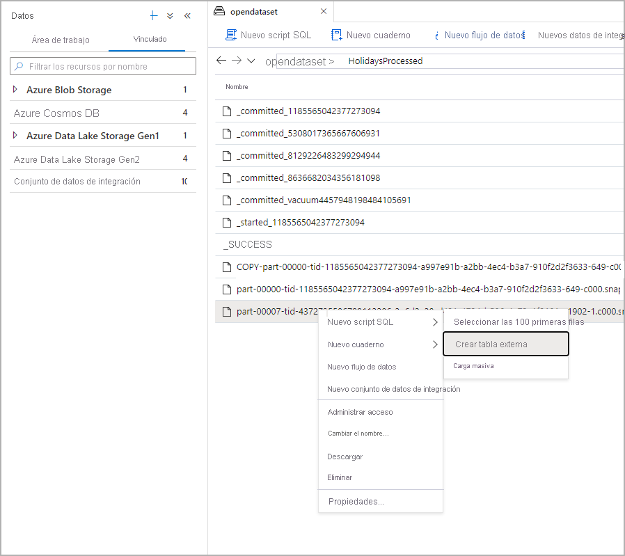
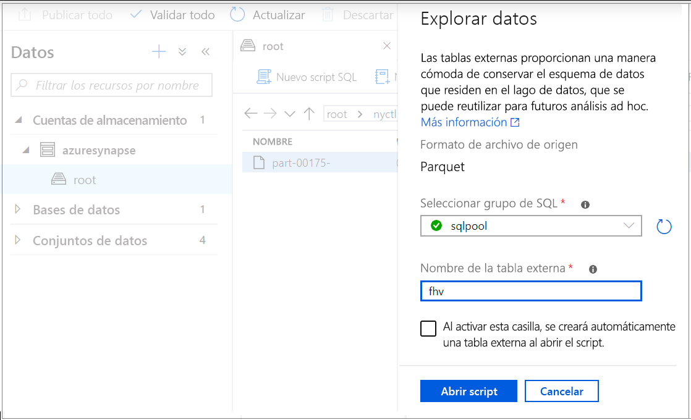
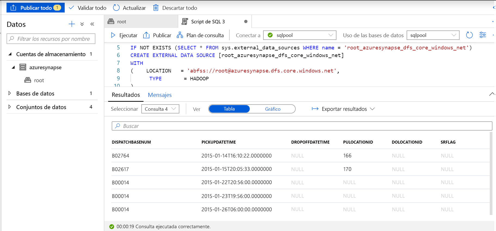

# <a name="use-external-tables-with-synapse-sql"></a>Uso de tablas externas con Synapse SQL

Una tabla externa apunta a datos ubicados en Hadoop, Azure Storage Blob o Azure Data Lake Storage. Las tablas externas se usan para leer datos de archivos de Azure Storage o escribir datos en ellos. Con Synapse SQL se pueden usar tablas externas para leer y escribir datos en un grupo de SQL dedicado o sin servidor.

## <a name="external-tables-in-dedicated-sql-pool-and-serverless-sql-pool"></a>Tablas externas en un grupo de SQL dedicado y en un grupo de SQL sin servidor

### <a name="dedicated-sql-pool"></a>[Grupo de SQL dedicado](#tab/sql-pool) 

En un grupo de SQL dedicado se puede usar una tabla externa para:

- Consultar Azure Blob Storage y Azure Data Lake Gen2 con instrucciones Transact-SQL.
- Importar y almacenar datos de Azure Blob Storage y Azure Data Lake Storage en un grupo de SQL dedicado.

Si se usa en combinación con la instrucción [CREATE TABLE AS SELECT](../sql-data-warehouse/sql-data-warehouse-develop-ctas.md?toc=/azure/synapse-analytics/toc.json&bc=/azure/synapse-analytics/breadcrumb/toc.json), al realizar la selección de una tabla externa importa los datos en una tabla de un grupo de SQL. Además de para la [instrucción COPY](/sql/t-sql/statements/copy-into-transact-sql?toc=/azure/synapse-analytics/toc.json&bc=/azure/synapse-analytics/breadcrumb/toc.json&view=azure-sqldw-latest&preserve-view=true), las tablas externas son útiles para cargar datos. 

Si desea ver un tutorial de carga, consulte el artículo en el que se explica el [uso de PolyBase para cargar datos de Azure Blob Storage](../sql-data-warehouse/load-data-from-azure-blob-storage-using-polybase.md?toc=/azure/synapse-analytics/toc.json&bc=/azure/synapse-analytics/breadcrumb/toc.json).

### <a name="serverless-sql-pool"></a>[Grupo de SQL sin servidor](#tab/sql-on-demand)

En un grupo de SQL sin servidor se puede usar una tabla externa para:

- Consultar datos de Azure Blob Storage y Azure Data Lake Storage con instrucciones Transact-SQL.
- Almacenar los resultados de las consultas del grupo de SQL sin servidor en archivos de Azure Blob Storage o Azure Data Lake Storage mediante [CETAS](develop-tables-cetas.md).

Para crear tablas externas mediante el grupo de SQL sin servidor, siga estos pasos:

1. CREATE EXTERNAL DATA SOURCE
2. CREATE EXTERNAL FILE FORMAT
3. CREATE EXTERNAL TABLE

---

### <a name="security"></a>Seguridad

El usuario debe tener permiso `SELECT` en la tabla externa para leer los datos.
La tabla externa accede al almacenamiento de Acceso subyacente mediante la credencial con ámbito de la base de datos definida en el origen de datos mediante las siguientes reglas:
- El origen de datos sin credenciales permite que las tablas externas accedan a archivos disponibles públicamente en Azure Storage.
- El origen de datos puede tener credenciales que permitan a las tablas externas acceder solo a los archivos de Azure Storage mediante el token de SAS o la identidad administrada del área de trabajo. En el artículo sobre el [desarrollo del control de acceso al almacenamiento de archivos](develop-storage-files-storage-access-control.md#examples).

> [!IMPORTANT]
> En un grupo de SQL dedicado, un origen de datos creado sin credenciales permite a los usuarios de Azure AD acceder a los archivos de almacenamiento mediante su identidad de Azure AD. En el grupo de SQL sin servidor es preciso crear un origen de datos con credenciales cuyo ámbito sea la base de datos y que tenga la propiedad `IDENTITY='User Identity'` (consulte los [ejemplos aquí](develop-storage-files-storage-access-control.md#examples)).

## <a name="create-external-data-source"></a>CREATE EXTERNAL DATA SOURCE

Los orígenes de datos externos se usan para conectarse a las cuentas de almacenamiento. La documentación completa se describe [aquí](/sql/t-sql/statements/create-external-data-source-transact-sql?toc=/azure/synapse-analytics/toc.json&bc=/azure/synapse-analytics/breadcrumb/toc.json&view=azure-sqldw-latest&preserve-view=true).

### <a name="syntax-for-create-external-data-source"></a>Sintaxis de CREATE EXTERNAL DATA SOURCE

#### <a name="dedicated-sql-pool"></a>[Grupo de SQL dedicado](#tab/sql-pool)

```syntaxsql
CREATE EXTERNAL DATA SOURCE <data_source_name>
WITH
(    LOCATION         = '<prefix>://<path>'
     [, CREDENTIAL = <database scoped credential> ]
     , TYPE = HADOOP
)
[;]
```

#### <a name="serverless-sql-pool"></a>[Grupo de SQL sin servidor](#tab/sql-on-demand)

```syntaxsql
CREATE EXTERNAL DATA SOURCE <data_source_name>
WITH
(    LOCATION         = '<prefix>://<path>'
     [, CREDENTIAL = <database scoped credential> ]
)
[;]
```

---

### <a name="arguments-for-create-external-data-source"></a>Argumentos de CREATE EXTERNAL DATA SOURCE

data_source_name

Especifica el nombre definido por el usuario para el origen de datos. El nombre debe ser único en la base de datos.

#### <a name="location"></a>Location
LOCATION = `'<prefix>://<path>'`: proporciona el protocolo de conectividad y la ruta de acceso al origen de datos externo. Estos patrones se pueden usar en la ubicación:

| Origen de datos externo        | Prefijo de ubicación | Ruta de acceso de ubicación                                         |
| --------------------------- | --------------- | ----------------------------------------------------- |
| Azure Blob Storage          | `wasb[s]`       | `<container>@<storage_account>.blob.core.windows.net` |
| Azure Blob Storage          | `http[s]`       | `<storage_account>.blob.core.windows.net/<container>/subfolders` |
| Azure Data Lake Store Gen1 | `http[s]`       | `<storage_account>.azuredatalakestore.net/webhdfs/v1` |
| Azure Data Lake Store Gen2 | `http[s]`       | `<storage_account>.dfs.core.windows.net/<container>/subfolders`  |

El prefijo `https:` le permite usar la subcarpeta en la ruta de acceso.

#### <a name="credential"></a>Credential:
CREDENTIAL = `<database scoped credential>` es una credencial opcional que se usará para realizar la autenticación en Azure Storage. El origen de datos externo sin credenciales puede acceder a una cuenta de almacenamiento público. 

Los orígenes de datos externos sin credenciales del grupo de SQL dedicado también usarán la identidad de Azure AD del autor de la llamada para acceder a los archivos almacenados. Los orígenes de datos externos del grupo de SQL sin servidor con credenciales `IDENTITY='User Identity'` usarán la identidad de Azure AD del autor de la llamada para acceder a los archivos.
- En un grupo de SQL dedicado, las credenciales cuyo ámbito es la base de datos pueden especificar una identidad de aplicación personalizada, una identidad administrada de área de trabajo o una clave SAK. 
- En un grupo de SQL sin servidor, las credenciales cuyo ámbito es la base de datos pueden especificar la identidad de Azure AD del autor de la llamada, una identidad administrada de área de trabajo o una clave SAS. 

#### <a name="type"></a>TYPE
TYPE = `HADOOP` es una opción obligatoria en el grupo de SQL dedicado y especifica que se usa la tecnología Polybase para acceder a los archivos subyacentes. Este parámetro no se puede usar en los grupos de SQL sin servidor que usen un lector nativo integrado.

### <a name="example-for-create-external-data-source"></a>Ejemplo de CREATE EXTERNAL DATA SOURCE

#### <a name="dedicated-sql-pool"></a>[Grupo de SQL dedicado](#tab/sql-pool)

En el ejemplo siguiente se crea un origen de datos externo para Azure Data Lake Gen2 que apunta al conjunto de datos de Nueva York:

```sql
CREATE EXTERNAL DATA SOURCE AzureDataLakeStore
WITH
  -- Please note the abfss endpoint when your account has secure transfer enabled
  ( LOCATION = 'abfss://data@newyorktaxidataset.dfs.core.windows.net' ,
    CREDENTIAL = ADLS_credential ,
    TYPE = HADOOP
  ) ;
```

#### <a name="serverless-sql-pool"></a>[Grupo de SQL sin servidor](#tab/sql-on-demand)

En el ejemplo siguiente se crea un origen de datos externo para Azure Data Lake Gen2 al que se puede acceder mediante las credenciales de SAS:

```sql
CREATE DATABASE SCOPED CREDENTIAL [sqlondemand]
WITH IDENTITY='SHARED ACCESS SIGNATURE',  
SECRET = 'sv=2018-03-28&ss=bf&srt=sco&sp=rl&st=2019-10-14T12%3A10%3A25Z&se=2061-12-31T12%3A10%3A00Z&sig=KlSU2ullCscyTS0An0nozEpo4tO5JAgGBvw%2FJX2lguw%3D'
GO

CREATE EXTERNAL DATA SOURCE SqlOnDemandDemo WITH (
    LOCATION = 'https://sqlondemandstorage.blob.core.windows.net',
    CREDENTIAL = sqlondemand
);
```

En el ejemplo siguiente se crea un origen de datos externo para Azure Data Lake Gen2 que apunta al conjunto de datos de Nueva York disponible públicamente:

```sql
CREATE EXTERNAL DATA SOURCE YellowTaxi
WITH ( LOCATION = 'https://azureopendatastorage.blob.core.windows.net/nyctlc/yellow/')
```
---

## <a name="create-external-file-format"></a>CREATE EXTERNAL FILE FORMAT

Crea un objeto de formato de archivo externo que define los datos externos almacenados en Azure Blob Storage o Azure Data Lake Store. La creación de un formato de archivo externo es un requisito previo para crear una tabla externa. La documentación completa se encuentra [aquí](/sql/t-sql/statements/create-external-file-format-transact-sql?toc=/azure/synapse-analytics/toc.json&bc=/azure/synapse-analytics/breadcrumb/toc.json&view=azure-sqldw-latest&preserve-view=true).

Al crear un formato de archivo externo, se especifica el diseño real de los datos a los que hace referencia una tabla externa.

### <a name="syntax-for-create-external-file-format"></a>Sintaxis de CREATE EXTERNAL FILE FORMAT

#### <a name="sql-pool"></a>[Grupo de SQL](#tab/sql-pool)

```syntaxsql
-- Create an external file format for PARQUET files.  
CREATE EXTERNAL FILE FORMAT file_format_name  
WITH (  
    FORMAT_TYPE = PARQUET  
    [ , DATA_COMPRESSION = {  
        'org.apache.hadoop.io.compress.SnappyCodec'  
      | 'org.apache.hadoop.io.compress.GzipCodec'      }  
    ]);  

--Create an external file format for DELIMITED TEXT files
CREATE EXTERNAL FILE FORMAT file_format_name  
WITH (  
    FORMAT_TYPE = DELIMITEDTEXT  
    [ , DATA_COMPRESSION = 'org.apache.hadoop.io.compress.GzipCodec' ]
    [ , FORMAT_OPTIONS ( <format_options> [ ,...n  ] ) ]  
    );  

<format_options> ::=  
{  
    FIELD_TERMINATOR = field_terminator  
    | STRING_DELIMITER = string_delimiter
    | First_Row = integer
    | USE_TYPE_DEFAULT = { TRUE | FALSE }
    | Encoding = {'UTF8' | 'UTF16'}
}
```

#### <a name="serverless-sql-pool"></a>[Grupo de SQL sin servidor](#tab/sql-on-demand)

```syntaxsql
-- Create an external file format for PARQUET files.  
CREATE EXTERNAL FILE FORMAT file_format_name  
WITH (  
    FORMAT_TYPE = PARQUET  
    [ , DATA_COMPRESSION = {  
        'org.apache.hadoop.io.compress.SnappyCodec'  
      | 'org.apache.hadoop.io.compress.GzipCodec'      }  
    ]);  

--Create an external file format for DELIMITED TEXT files
CREATE EXTERNAL FILE FORMAT file_format_name  
WITH (  
    FORMAT_TYPE = DELIMITEDTEXT  
    [ , DATA_COMPRESSION = 'org.apache.hadoop.io.compress.GzipCodec' ]
    [ , FORMAT_OPTIONS ( <format_options> [ ,...n  ] ) ]  
    );  

<format_options> ::=  
{  
    FIELD_TERMINATOR = field_terminator  
    | STRING_DELIMITER = string_delimiter
    | First_Row = integer
    | USE_TYPE_DEFAULT = { TRUE | FALSE }
    | Encoding = {'UTF8' | 'UTF16'}
    | PARSER_VERSION = {'parser_version'}
}
```

---


### <a name="arguments-for-create-external-file-format"></a>Argumentos para CREATE EXTERNAL FILE FORMAT

file_format_name: especifica un nombre para el formato de archivo externo.

FORMAT_TYPE = [ PARQUET | DELIMITEDTEXT]: especifica el formato de los datos externos.

- PARQUET: especifica un formato Parquet.
- DELIMITEDTEXT: especifica un formato de texto con delimitadores de columna, también denominados terminadores de campo.

FIELD_TERMINATOR = *field_terminator*: solo se aplica a archivos de texto delimitado. El terminador de campo especifica uno o varios caracteres que marcan el final de cada campo (columna) en el archivo de texto delimitado. El valor predeterminado es el carácter de barra vertical ("|").

Ejemplos:

- FIELD_TERMINATOR = '|'
- FIELD_TERMINATOR = ' '
- FIELD_TERMINATOR = ꞌ\tꞌ

STRING_DELIMITER = *string_delimiter*: especifica el terminador de campo de los datos de tipo cadena en el archivo de texto delimitado. El delimitador de cadena tiene una longitud de uno o más caracteres y se escribe entre comillas simples. El valor predeterminado es la cadena vacía ("").

Ejemplos:

- STRING_DELIMITER = '"'
- STRING_DELIMITER = '*'
- STRING_DELIMITER = ꞌ,ꞌ

FIRST_ROW = *First_row_int*: especifica el número de fila que se lee primero y se aplica a todos los archivos. Si establece el valor en dos hará que se omita la primera fila de cada archivo (fila de encabezado) al cargar los datos. Las filas se omiten en función de la existencia de terminadores de fila (/r/n, /r, /n).

USE_TYPE_DEFAULT = { TRUE | **FALSE** }: especifica cómo administrar valores que faltan en archivos de texto delimitado al recuperar datos del archivo de texto.

TRUE: si va a recuperar datos del archivo de texto, almacene todos los valores que falten mediante el tipo de datos del valor predeterminado para la columna correspondiente en la definición de la tabla externa. Por ejemplo, reemplace un valor que falta con:

- 0 si la columna se define como una columna numérica. Las columnas decimales no se admiten y provocarán un error.
- Cadena vacía ("") si la columna es una columna de cadena.
- 1900-01-01 si la columna es una columna de fecha.

FALSE: almacena todos los valores que faltan como NULL. Los valores NULL que se almacenan mediante la palabra NULL en el archivo de texto delimitado se importan como la cadena 'NULL'.

Encoding = {'UTF8' | 'UTF16'}: el grupo de SQL sin servidor puede leer archivos de texto delimitados con codificación UTF8 y UTF16.

DATA_COMPRESSION = *data_compression_method*: este argumento especifica el método de compresión de datos para los datos externos. 

El tipo de formato PARQUET admite estos métodos de compresión:

- DATA_COMPRESSION = 'org.apache.hadoop.io.compress.GzipCodec'
- DATA_COMPRESSION = 'org.apache.hadoop.io.compress.SnappyCodec'

Al leer de tablas externas de PARQUET, este argumento se omite, pero se usa al escribir en tablas externas mediante [CETAS](develop-tables-cetas.md).

El tipo de formato de archivo DELIMITEDTEXT admite estos métodos de compresión:

- DATA_COMPRESSION = 'org.apache.hadoop.io.compress.GzipCodec'

PARSER_VERSION = 'parser_version' especifica la versión del analizador que se utilizará al leer los archivos. Consulte el argumento PARSER_VERSION en los [argumentos OPENROWSET](develop-openrowset.md#arguments) para más información.

### <a name="example-for-create-external-file-format"></a>Ejemplo de CREATE EXTERNAL FILE FORMAT

En el ejemplo siguiente se crea un formato de archivo externo para los archivos del censo:

```sql
CREATE EXTERNAL FILE FORMAT census_file_format
WITH
(  
    FORMAT_TYPE = PARQUET,
    DATA_COMPRESSION = 'org.apache.hadoop.io.compress.SnappyCodec'
)
```

## <a name="create-external-table"></a>CREATE EXTERNAL TABLE

El comando CREATE EXTERNAL TABLE crea una tabla externa para Synapse SQL para acceder a los datos almacenados en Azure Blob Storage o Azure Data Lake Storage. 

### <a name="syntax-for-create-external-table"></a>Sintaxis de CREATE EXTERNAL TABLE

```sql
CREATE EXTERNAL TABLE { database_name.schema_name.table_name | schema_name.table_name | table_name }
    ( <column_definition> [ ,...n ] )  
    WITH (
        LOCATION = 'folder_or_filepath',  
        DATA_SOURCE = external_data_source_name,  
        FILE_FORMAT = external_file_format_name
    )  
[;]  

<column_definition> ::=
column_name <data_type>
    [ COLLATE collation_name ]
```

### <a name="arguments-create-external-table"></a>Argumento de CREATE EXTERNAL TABLE

*{ database_name.schema_name.table_name | schema_name.table_name | table_name }*

Nombre de entre una y tres partes de la tabla que se va a crear. Si se trata de una tabla externa, el grupo de SQL sin servidor almacena solo sus metadatos. En el grupo de SQL sin servidor, no se desplazan ni se almacenan datos reales.

<column_definition>, ...*n* ]

CREATE EXTERNAL TABLE admite la capacidad de configurar el nombre de columna, tipo de datos, nulabilidad e intercalación. No se puede usar DEFAULT CONSTRAINT en tablas externas.

>[!IMPORTANT]
>Las definiciones de columna, incluidos los tipos de datos y el número de columnas, deben coincidir con los datos de los archivos externos. Si hay algún error de coincidencia, se rechazarán las filas de archivo al consultar los datos reales.

Al leer archivos con formato Parquet, solo puede especificar las columnas que desea leer y omitir el resto.

LOCATION = '*folder_or_filepath*'

Especifica la carpeta o la ruta de acceso del archivo y el nombre de archivo de los datos reales en Azure Blob Storage. La ubicación empieza desde la carpeta raíz. La carpeta raíz es la ubicación de datos especificada en el origen de datos externo.

Si especifica un valor de LOCATION de una carpeta, una consulta del grupo de SQL sin servidor seleccionará la carpeta de la tabla externa y recuperará los archivos.

> [!NOTE]
> A diferencia de Hadoop y PolyBase, el grupo de SQL sin servidor no devuelve subcarpetas. Devuelve los archivos cuyo nombre comienza por un carácter de subrayado (_) o un punto (.).

En este ejemplo, si LOCATION='/webdata/', una consulta del grupo de SQL sin servidor devolverá filas de mydata.txt y _hidden.txt. No devolverá mydata2. txt y mydata3. txt porque se encuentran en una subcarpeta.


DATA_SOURCE = *external_data_source_name*: especifica el nombre del origen de datos externo que contiene la ubicación de los datos externos. Para crear un origen de datos externo, use[CREATE EXTERNAL DATA SOURCE](#create-external-data-source).

FILE_FORMAT = *external_file_format_name*: especifica el nombre del objeto de formato de archivo externo que almacena el tipo de archivo y el método de compresión de los datos externos. Para crear un formato de archivo externo, use [CREATE EXTERNAL FILE FORMAT](#create-external-file-format).

### <a name="permissions-create-external-table"></a>Permisos de CREATE EXTERNAL TABLE

Para realizar la selección en una tabla externa, se necesitan las credenciales adecuadas con permisos de lectura y de lista.

### <a name="example-create-external-table"></a>Ejemplo de CREATE EXTERNAL TABLE

En el ejemplo siguiente se crea una tabla externa. Devuelve la primera fila:

```sql
CREATE EXTERNAL TABLE census_external_table
(
    decennialTime varchar(20),
    stateName varchar(100),
    countyName varchar(100),
    population int,
    race varchar(50),
    sex    varchar(10),
    minAge int,
    maxAge int
)  
WITH (
    LOCATION = '/parquet/',
    DATA_SOURCE = population_ds,  
    FILE_FORMAT = census_file_format
)
GO

SELECT TOP 1 * FROM census_external_table
```

## <a name="create-and-query-external-tables-from-a-file-in-azure-data-lake"></a>Creación y consulta de tablas externas a partir de un archivo en Azure Data Lake

Mediante las funcionalidades de exploración de Data Lake ya se puede crear y consultar una tabla externa mediante un grupo de SQL dedicado o sin servidor con un solo clic con el botón derecho en el archivo.

### <a name="prerequisites"></a>Requisitos previos

- Debe acceder al área de trabajo al menos con el rol de acceso basado en ARM Colaborador de datos de blobs de almacenamiento a la cuenta de ADLS Gen2

- Debe tener al menos [permisos para crear](/sql/t-sql/statements/create-external-table-transact-sql?toc=/azure/synapse-analytics/toc.json&bc=/azure/synapse-analytics/breadcrumb/toc.json&view=azure-sqldw-latest#permissions-2&preserve-view=true) y consultar tablas externas en el grupo de SQL o SQL a petición

En el panel Data (Datos), seleccione el archivo desde el que desea crear la tabla externa:
> [!div class="mx-imgBorder"]
>

Se abrirá una ventana de diálogo. Seleccione un grupo de SQL dedicado o sin servidor, asígnele un nombre a la tabla y seleccione Abrir script:

> [!div class="mx-imgBorder"]
>

El script de SQL se genera automáticamente e infiere el esquema del archivo:
> [!div class="mx-imgBorder"]
>

Ejecute el script. El script ejecutará automáticamente una instrucción Select Top 100 *:
> [!div class="mx-imgBorder"]
>

Ahora se crea la tabla externa, para una futura exploración del contenido de esta tabla externa el usuario puede consultarla directamente desde el panel Data (Datos):
> [!div class="mx-imgBorder"]
>

## <a name="next-steps"></a>Pasos siguientes

Consulte el artículo [CETAS](develop-tables-cetas.md) para obtener información sobre cómo guardar los resultados de una consulta en una tabla externa en Azure Storage. O bien puede empezar a consultar [Tablas externas de Apache Spark para Azure Synapse](develop-storage-files-spark-tables.md).
