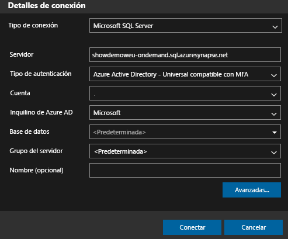
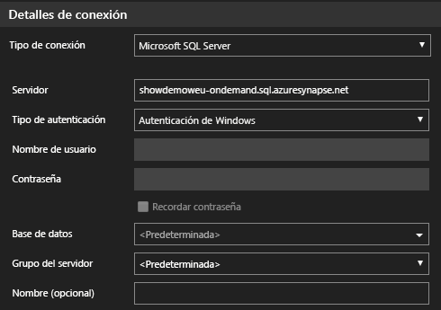
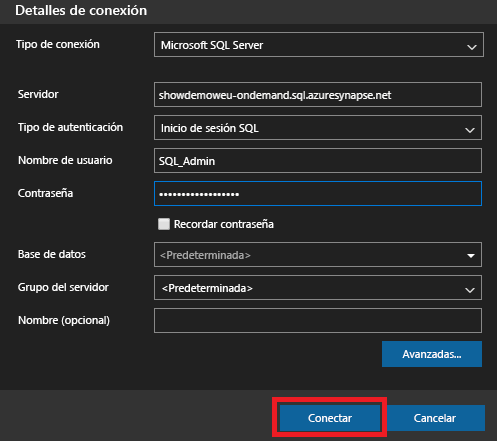
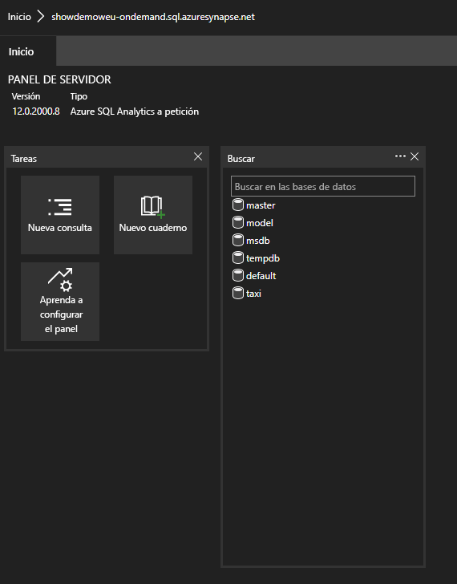
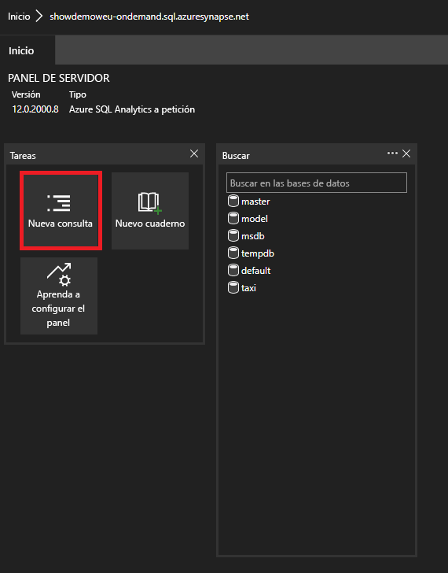

# <a name="connect-to-synapse-sql-with-azure-data-studio-preview"></a>Conexión a Synapse SQL con Azure Data Studio (versión preliminar)

> [!div class="op_single_selector"]
>
> * [Azure Data Studio](get-started-azure-data-studio.md)
> * [Power BI](get-started-power-bi-professional.md)
> * [Visual Studio](../sql-data-warehouse/sql-data-warehouse-query-visual-studio.md?toc=/azure/synapse-analytics/toc.json&bc=/azure/synapse-analytics/breadcrumb/toc.json)
> * [sqlcmd](get-started-connect-sqlcmd.md)
> * [SSMS](get-started-ssms.md)

Puede usar [Azure Data Studio (versión preliminar)](/sql/azure-data-studio/download-azure-data-studio?toc=/azure/synapse-analytics/toc.json&bc=/azure/synapse-analytics/breadcrumb/toc.json&view=azure-sqldw-latest) para conectarse a Synapse SQL en Azure Synapse Analytics y realizar consultas. 

## <a name="connect"></a>Conectar

Para conectarse a Synapse SQL, abra Azure Data Studio y seleccione **Nueva conexión**.


Seleccione **Microsoft SQL Server** como **Tipo de conexión**.

La cadena de conexión requiere los siguientes parámetros:

* **Server:** Servidor con el formato `<Azure Synapse workspace name>`-ondemand.sql.azuresynapse.net
* **Base de datos** Nombre de la base de datos

> [!NOTE]
> Si desea usar el **grupo de SQL sin servidor (versión preliminar)** , la dirección URL debe ser similar a la siguiente:
>
> - `<Azure Synapse workspace name>`-ondemand.sql.azuresynapse.net.
>
> Si desea usar el **grupo de SQL dedicado** , la dirección URL debe ser similar a la siguiente:
>
> - `<Azure Synapse workspace name>`.sql.azuresynapse.net

Elija **Autenticación de Windows** , **Azure Active Directory** o **Inicio de sesión de SQL** como **Tipo de autenticación**.

Para utilizar **Inicio de sesión SQL** como tipo de autenticación, agregue los parámetros de nombre de usuario y contraseña:

* **Usuario** : usuario del servidor con el formato `<User>`
* **Contraseña:** contraseña asociada con el usuario.

Para usar Azure Active Directory, debe elegir el tipo de autenticación necesario.



En la siguiente captura de pantalla se muestran los **detalles de conexión** de la **autenticación de Windows** :



En la siguiente captura de pantalla se muestran los **detalles de conexión** con el **inicio de sesión de SQL** :



Después del inicio de sesión correcto, debería ver un panel similar al siguiente: 

## <a name="query"></a>Consultar

Una vez conectado, puede consultar Synapse SQL mediante instrucciones [Transact-SQL (T-SQL)](/sql/t-sql/language-reference?toc=/azure/synapse-analytics/toc.json&bc=/azure/synapse-analytics/breadcrumb/toc.json&view=azure-sqldw-latest) compatibles con la instancia. Seleccione **Nueva consulta** en la vista de panel para comenzar.



Por ejemplo, puede usar la siguiente instrucción Transact-SQL para [consultar archivos Parquet](query-parquet-files.md) mediante el grupo de SQL sin servidor:

```sql
SELECT COUNT(*)
FROM  
OPENROWSET(
    BULK 'https://azureopendatastorage.blob.core.windows.net/censusdatacontainer/release/us_population_county/year=20*/*.parquet',
    FORMAT='PARQUET'
)
```
## <a name="next-steps"></a>Pasos siguientes 
Explore otras formas de conectarse a Synapse SQL: 

- [SSMS](get-started-ssms.md)
- [Power BI](get-started-power-bi-professional.md)
- [Visual Studio](../sql-data-warehouse/sql-data-warehouse-query-visual-studio.md?toc=/azure/synapse-analytics/toc.json&bc=/azure/synapse-analytics/breadcrumb/toc.json)
- [sqlcmd](get-started-connect-sqlcmd.md)

Para más información, visite [Uso de Azure Data Studio para conectarse y consultar datos mediante un grupo de SQL dedicado en Azure Synapse Analytics](https://docs.microsoft.com/sql/azure-data-studio/quickstart-sql-dw). 
