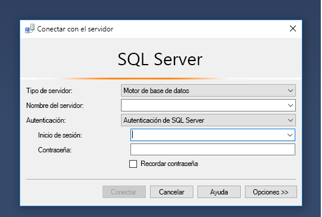
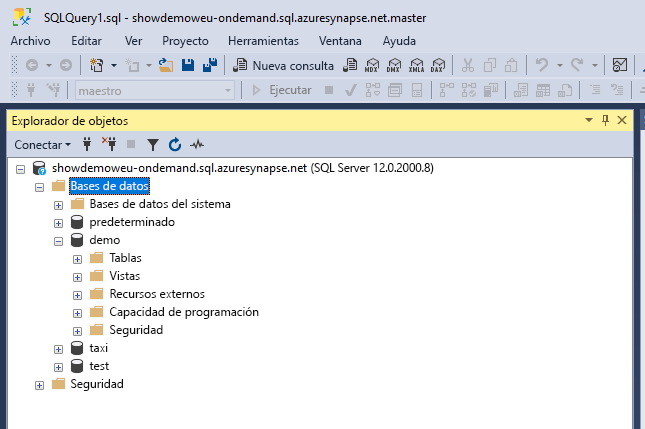
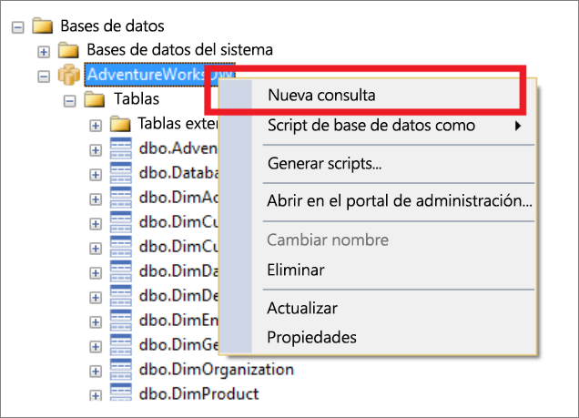
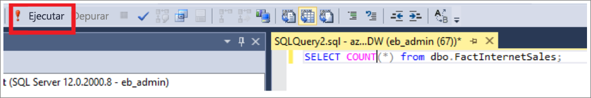
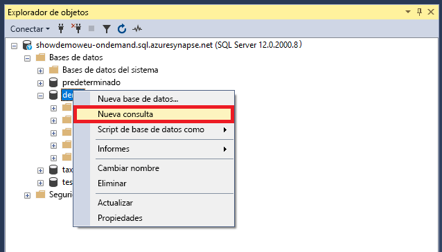
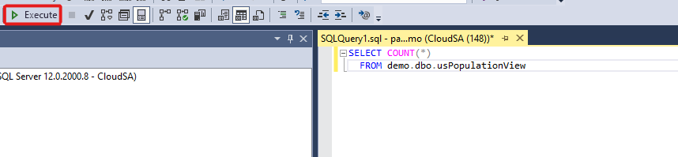
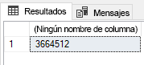

# <a name="connect-to-synapse-sql-with-sql-server-management-studio-ssms"></a>Conexión a Synapse SQL con SQL Server Management Studio (SSMS)
> [!div class="op_single_selector"]
> * [Azure Data Studio](get-started-azure-data-studio.md)
> * [Power BI](get-started-power-bi-professional.md)
> * [Visual Studio](../sql-data-warehouse/sql-data-warehouse-query-visual-studio.md?toc=/azure/synapse-analytics/toc.json&bc=/azure/synapse-analytics/breadcrumb/toc.json)
> * [sqlcmd](../sql/get-started-connect-sqlcmd.md)
> * [SSMS](get-started-ssms.md)
> 
> 

Puede usar [SQL Server Management Studio (SSMS)](/sql/ssms/download-sql-server-management-studio-ssms) para conectarse y realizar consultas a Synapse SQL en Azure Synapse Analytics con los recursos de SQL a petición (versión preliminar) o del grupo de SQL. 

### <a name="supported-tools-for-sql-on-demand-preview"></a>Herramientas compatibles con SQL a petición (versión preliminar)

SSMS se admite parcialmente a partir de la versión 18.5 con características limitadas como la conexión y la consulta. [Azure Data Studio](/sql/azure-data-studio/download-azure-data-studio) se admite por completo.

## <a name="prerequisites"></a>Prerrequisitos

Asegúrese de que cumple los siguientes requisitos previos antes de empezar:  

* [SQL Server Management Studio (SSMS)](/sql/ssms/download-sql-server-management-studio-ssms). 
* Para el grupo de SQL, necesita un almacén de datos existente. Para crear uno, vea [Creación de un grupo de SQL](../quickstart-create-sql-pool.md). En el caso de SQL a petición, ya se ha aprovisionado uno en el área de trabajo en el momento de la creación. 
* El nombre del servidor SQL completo. Para encontrarlo, consulte [Conexión a Synapse SQL](connect-overview.md).

## <a name="connect"></a>Conectar

### <a name="sql-pool"></a>Grupo de SQL

Para conectarse a Synapse SQL mediante el grupo de SQL, siga estos pasos: 

1. Abra SQL Server Management Studio (SSMS). 
1. En el cuadro de diálogo **Conectar a servidor**, rellene los campos y, a continuación, seleccione **Conectar**: 
  
    
   
   * **Nombre del servidor**: Escriba el **nombre del servidor** definido anteriormente.
   * **Autenticación**:  Elija un tipo de autenticación como, por ejemplo, **Autenticación de SQL Server** o **Autenticación integrada de Active Directory**.
   * **Nombre de usuario** y **contraseña**: Escriba su nombre de usuario y la contraseña si la autenticación de SQL Server se seleccionó anteriormente.

1. Expanda el servidor de Azure SQL Server en **Explorador de objetos**. Puede ver las bases de datos asociadas al servidor, como la base de datos AdventureWorksDW de ejemplo. Puede expandir la base de datos para ver las tablas:
   
    


### <a name="sql-on-demand-preview"></a>SQL a petición (versión preliminar)

Para conectarse a Synapse SQL mediante SQL a petición, siga estos pasos: 

1. Abra SQL Server Management Studio (SSMS).
1. En el cuadro de diálogo **Conectar a servidor**, rellene los campos y, a continuación, seleccione **Conectar**: 
   
    
   
   * **Nombre del servidor**: Escriba el **nombre del servidor** definido anteriormente.
   * **Autenticación**: Elija un tipo de autenticación como, por ejemplo, **Autenticación de SQL Server** o **Autenticación integrada de Active Directory**:
   * **Nombre de usuario** y **contraseña**: Escriba su nombre de usuario y la contraseña si la autenticación de SQL Server se seleccionó anteriormente.
   * Haga clic en **Conectar**.

4. Para explorar, expanda su Azure SQL Server. Puede ver las bases de datos asociadas al servidor. Expanda *demo* para ver el contenido de la base de datos de ejemplo.
   
    


## <a name="run-a-sample-query"></a>Ejecución de una consulta de ejemplo

### <a name="sql-pool"></a>Grupo de SQL

Ahora que se ha establecido una conexión de base de datos, puede consultar los datos.

1. Haga clic con el botón derecho en la base de datos en el Explorador de objetos de SQL Server.
2. Seleccione **Nueva consulta**. Se abrirá una nueva ventana de consulta.
   
    
3. Copie esta consulta T-SQL en la ventana de consulta:
   
    ```sql
    SELECT COUNT(*) FROM dbo.FactInternetSales;
    ```
4. Ejecuta la consulta. Para hacerlo, haga clic en `Execute` o use la combinación de teclas `F5`.
   
    
5. Consulte los resultados de la consulta. En este ejemplo, la tabla FactInternetSales tiene 60398 filas.
   
    

### <a name="sql-on-demand"></a>SQL a petición

Ahora que se ha establecido una conexión de base de datos, puede consultar los datos.

1. Haga clic con el botón derecho en la base de datos en el Explorador de objetos de SQL Server.
2. Seleccione **Nueva consulta**. Se abrirá una nueva ventana de consulta.
   
    
3. Copie la siguiente consulta T-SQL en la ventana de consulta:
   
    ```sql
    SELECT COUNT(*) FROM demo.dbo.usPopulationView
    ```
4. Ejecuta la consulta. Para hacerlo, haga clic en `Execute` o use la combinación de teclas `F5`.
   
    
5. Consulte los resultados de la consulta. En este ejemplo, la vista usPopulationView tiene 3664512 filas.
   
    

## <a name="next-steps"></a>Pasos siguientes
Ahora que puede conectarse y realizar consultas, intente realizar la [Visualización de datos con Power BI](get-started-power-bi-professional.md).

Para configurar el entorno para la autenticación de Azure Active Directory, consulte [Autenticación en Synapse SQL](../sql-data-warehouse/sql-data-warehouse-authentication.md?toc=/azure/synapse-analytics/toc.json&bc=/azure/synapse-analytics/breadcrumb/toc.json).

