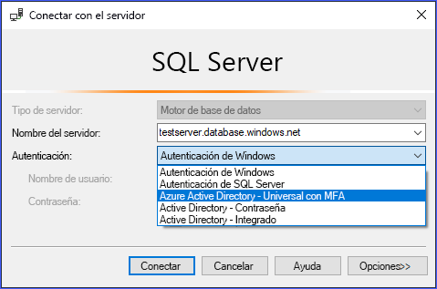
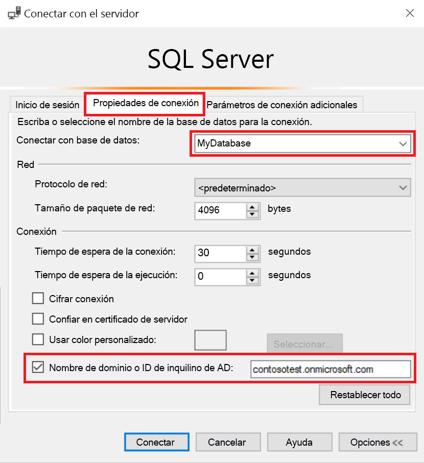
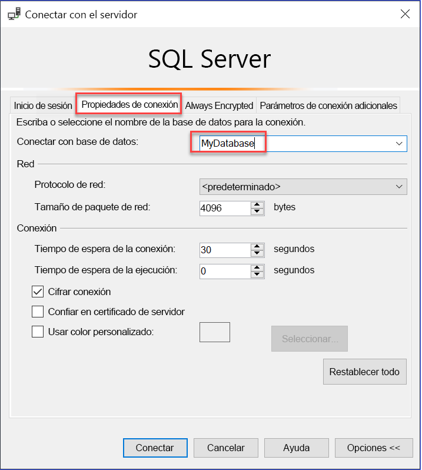

# Uso de la autenticación de AAD multifactor con Synapse SQL (compatibilidad de SSMS con MFA)

Synapse SQL admite conexiones procedentes de SQL Server Management Studio (SSMS) mediante la *Autenticación universal de Active Directory*. 

En este artículo se describen las diferencias entre las distintas opciones de autenticación, así como las limitaciones asociadas con el uso de la autenticación universal. 

**Descarga de la versión de SSMS más reciente**: en el equipo cliente, descargue la versión más reciente de SSMS desde [Descarga de SQL Server Management Studio (SSMS)](https://msdn.microsoft.com/library/mt238290.aspx). 

**Descarga de la versión de SSMS más reciente**: en el equipo cliente, descargue la versión más reciente de SSMS desde [Descarga de SQL Server Management Studio (SSMS)](/sql/ssms/download-sql-server-management-studio-ssms?toc=/azure/synapse-analytics/toc.json&bc=/azure/synapse-analytics/breadcrumb/toc.json&view=azure-sqldw-latest).

Para todas las características que se tratan en este artículo, utilice al menos la versión 17.2 de julio de 2017.  El cuadro de diálogo de conexión más reciente debe ser similar a la siguiente imagen:

  

## Las cinco opciones de autenticación  

La autenticación universal de Active Directory admite los dos métodos de autenticación no interactiva:
    - autenticación `Active Directory - Password`
    - autenticación `Active Directory - Integrated`

También hay dos modelos de autenticación no interactiva, que se pueden usar en muchas aplicaciones diferentes (ADO.NET, JDCB, ODC, etc.). Estos dos métodos nunca generan cuadros de diálogo emergentes:

- `Active Directory - Password`
- `Active Directory - Integrated`

El método interactivo que también admite Azure Multi-Factor Authentication (MFA) es:

- `Active Directory - Universal with MFA`

Azure MFA ayuda a proteger el acceso a los datos y las aplicaciones mientras se cumple la exigencia del usuario en cuanto a un proceso de inicio de sesión simple. Ofrece una autenticación segura con una gran variedad de opciones sencillas de verificación, como llamadas telefónicas, mensajes de texto, tarjetas inteligentes con PIN o notificaciones de aplicaciones móviles, lo que permite a los usuarios elegir el mecanismo que prefieran. MFA interactivo con Azure AD puede generar un cuadro de diálogo emergente para la validación.

Para una descripción de Multi-Factor Authentication, consulte [Multi-Factor Authentication](../../active-directory/authentication//concept-mfa-howitworks.md?toc=/azure/synapse-analytics/toc.json&bc=/azure/synapse-analytics/breadcrumb/toc.json).

### Nombre de dominio de Azure AD o parámetro de identificador de inquilino

A partir de la [versión 17 de SSMS](/sql/ssms/download-sql-server-management-studio-ssms?toc=/azure/synapse-analytics/toc.json&bc=/azure/synapse-analytics/breadcrumb/toc.json&view=azure-sqldw-latest), los usuarios que se importan como invitados en la instancia actual de Active Directory desde otras instancias, pueden proporcionar el nombre de dominio de Azure AD o el identificador de inquilino cuando se conectan. 

Los usuarios invitados incluyen los que lo son desde otras instancias de Azure AD, cuentas de Microsoft como outlook.com, hotmail.com o live.com, u otras cuentas como gmail.com. Esta información permite que **Active Directory universal con MFA Authentication** identifique la entidad de autenticación correcta. Esta opción también se requiere para admitir cuentas de Microsoft (MSA), como outlook.com, hotmail.com o live.com, y otras cuentas que no son MSA. 

Todos los usuarios que deseen que se emplee en ellos la autenticación universal deben escribir su nombre de dominio o identificador de inquilino de Azure AD. Este parámetro representa el nombre de dominio o identificador de inquilino actuales de Azure AD al que el servidor Azure está vinculado. 

Por ejemplo, si el servidor Azure está asociado al dominio de Azure AD `contosotest.onmicrosoft.com` en el que el usuario `joe@contosodev.onmicrosoft.com` está hospedado como un usuario importado del dominio de Azure AD `contosodev.onmicrosoft.com`, el nombre de dominio requerido para autenticar este usuario es `contosotest.onmicrosoft.com`. 

Cuando el usuario es un usuario nativo de Azure AD vinculado al servidor Azure y no es una cuenta MSA, no se requieren el identificador de inquilino ni el nombre de dominio. 

Para especificar el parámetro (a partir de la versión 17.2 de SSMS), en el cuadro de diálogo **Conectar con base de datos**, rellene el cuadro de diálogo, seleccione la autenticación **Active Directory: Universal con MFA**, haga clic en **Opciones**, rellene el cuadro **Nombre de usuario** y, a continuación, haga clic en la pestaña **Propiedades de conexión**. 

Active la casilla **Nombre de dominio o ID de inquilino de AD** y proporcione la entidad de autenticación, por ejemplo, el nombre de dominio (**contosoprueba.enmicrosoft.com**) o el GUID del identificador del inquilino.  

   

Si está ejecutando SSMS 18.x o posterior, ya no son necesarios el nombre de dominio de AD o el identificador de inquilino para los usuarios invitados porque a partir de esta versión ya se reconocen automáticamente.

   

### Compatibilidad con aplicaciones empresariales de Azure AD   
Los usuarios de Azure AD admitidos en escenarios empresariales (B2B) de Azure AD como invitados (consulte [¿Qué es la colaboración B2B de Azure](../../active-directory/b2b/what-is-b2b.md?toc=/azure/synapse-analytics/toc.json&bc=/azure/synapse-analytics/breadcrumb/toc.json)) pueden conectarse a Synapse SQL únicamente como miembros de un grupo creado en Azure AD actual y asignado manualmente mediante la instrucción `CREATE USER` de Transact-SQL en una base de datos determinada. 

Por ejemplo, si `steve@gmail.com` es invitado a `contosotest` de Azure AD (con el dominio de Azure AD `contosotest.onmicrosoft.com`), debe crearse en Azure AD un grupo de Azure AD, como `usergroup`, que contenga el miembro `steve@gmail.com`. Después, el administrador de Azure AD SQL o un administrador de base de datos de Azure AD debe crear este grupo para una base de datos específica (por ejemplo, MyDatabase) ejecutando una instrucción `CREATE USER [usergroup] FROM EXTERNAL PROVIDER` de Transact-SQL. 

Después de crear el usuario de base de datos, el usuario `steve@gmail.com` puede iniciar sesión en `MyDatabase` con la opción de autenticación de SSMS `Active Directory – Universal with MFA support`. 

De forma predeterminada, el grupo de usuarios tiene el permiso de conexión y cualquier acceso adicional a los datos tendrá que concederse de la manera normal. 

Tenga en cuenta que el usuario `steve@gmail.com`, como invitado, debe activar la casilla y agregar el nombre de dominio de AD `contosotest.onmicrosoft.com` en el cuadro de diálogo **Propiedad de conexión** de SSMS. La opción **Nombre de dominio o ID de inquilino de AD** solo se admite para las opciones Universal con conexión MFA, en caso contrario se atenúa.

## Limitaciones de Autenticación universal para Synapse SQL

- SSMS y SqlPackage.exe son las únicas herramientas que actualmente están habilitadas para MFA a través de Autenticación universal de Active Directory.
- La versión 17.2 de SSMS admite el acceso simultáneo de varios usuarios mediante Autenticación universal con MFA. Las versiones 17.0 y 17.1 se limitan a un inicio de sesión para una instancia de SSMS con Autenticación universal para una sola cuenta de Azure Active Directory. Para iniciar sesión con otra cuenta de Azure AD, debe usar otra instancia de SSMS. (Esta restricción se limita a Autenticación universal de Active Directory. Puede iniciar sesión en distintos servidores con Autenticación de contraseña de Active Directory, Autenticación integrada de Active Directory o Autenticación de SQL Server).
- SSMS admite Autenticación universal de Active Directory para la visualización de Explorador de objetos, Editor de consultas y Almacén de consultas.
- La versión 17.2 de SSMS proporciona compatibilidad con el asistente de DacFx para la base de datos de exportación, extracción e implementación. Una vez que se autentica un usuario específico mediante el cuadro de diálogo de autenticación inicial con Autenticación universal, el asistente de DacFx funciona del mismo modo que con todos los demás métodos de autenticación.
- El Diseñador de tablas de SSMS no admite Autenticación universal.
- No hay ningún requisito de software adicional para Autenticación universal de Active Directory, excepto el uso de una versión compatible de SSMS.  
- Se actualizó la versión de la Biblioteca de autenticación de Active Directory (ADAL) para Autenticación universal a su versión de lanzamiento disponible más reciente ADAL.dll 3.13.9. Consulte [Biblioteca de autenticación de Active Directory 3.14.1](https://www.nuget.org/packages/Microsoft.IdentityModel.Clients.ActiveDirectory/).  

## Pasos siguientes
Para más información, consulte el artículo [Conexión a Synapse SQL con SQL Server Management Studio (SSMS)](get-started-ssms.md). 

