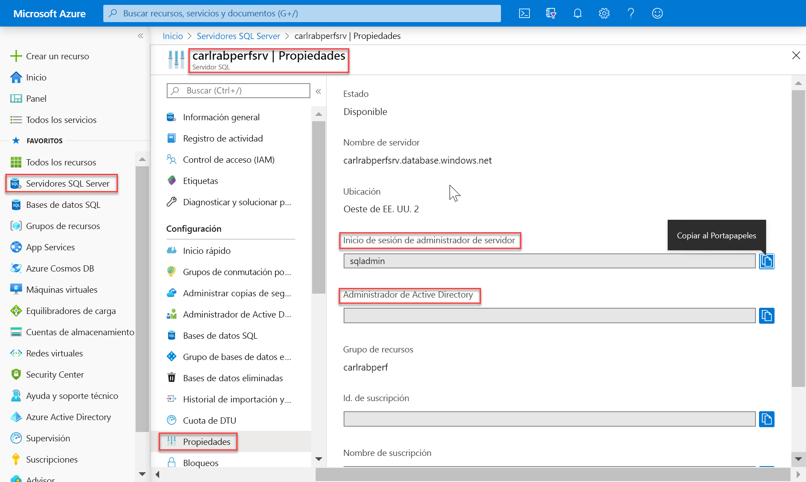
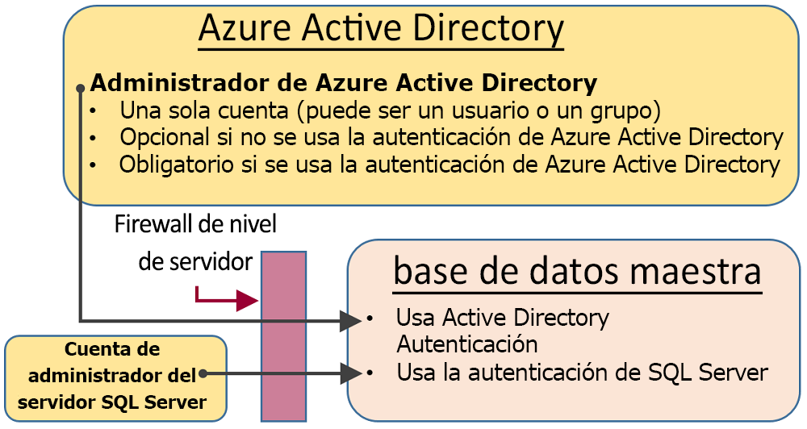
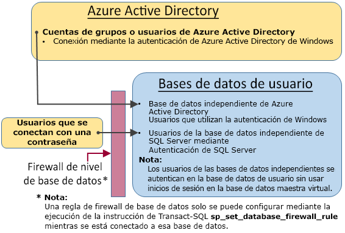

# <a name="sql-authentication"></a>Autenticación de SQL

Azure Synapse Analytics tiene dos factores de forma SQL que le permiten controlar el consumo de recursos. En este artículo se explica de qué forma controlan los dos factores de forma la autenticación de usuario.

Para realizar la autorización en Synapse SQL, puede usar dos tipos de autorización:

- Autorización de AAD
- Autorización de SQL

La autorización de AAD usa Azure Active Directory y permite tener un único lugar para la administración de usuarios. La autorización de SQL permite a las aplicaciones heredadas usar Synapse SQL de forma muy familiar.

## <a name="administrative-accounts"></a>Cuentas administrativas

Hay dos cuentas administrativas (**administrador del servidor** y **administrador de Active Directory**) que actúan como administradores. Para identificar estas cuentas de administrador de SQL Server, abra Azure Portal y vaya a la pestaña Propiedades de Synapse SQL.



- **Administrador del servidor**

  Al crear una instancia de Azure Synapse Analytics, debe asignar un nombre a un **inicio de sesión de administrador del servidor**. SQL Server crea esa cuenta como un inicio de sesión en la base de datos maestra. Esta cuenta se conecta mediante la autenticación de SQL Server (nombre de usuario y contraseña). Solo puede existir una de estas cuentas.

- **Administrador de Azure Active Directory**

  Una cuenta de Azure Active Directory, individual o una cuenta de grupo de seguridad, también se puede configurar como administrador. Opcionalmente, se puede configurar un administrador de Azure AD, pero es **obligatorio** hacerlo si se desea usar cuentas de Azure AD para conectarse a Synapse SQL.

Las cuentas de **administrador del servidor** y de **administrador de Azure AD** tienen las características siguientes:

- Son las únicas cuentas que pueden conectarse automáticamente a cualquier instancia de SQL Database en el servidor. (Para conectarse a una base de datos de usuario, las otras cuentas deben ser el propietario de la base de datos o tener una cuenta de usuario en la base de datos de usuario).
- Acceden a las bases de datos de usuario como usuario `dbo` y tienen todos los permisos en las bases de datos de usuario. (El propietario de una base de datos de usuario también accede a la base de datos como usuario `dbo`).
- No acceden a la `master`base de datos como `dbo` usuario y tienen permisos limitados en la base de datos maestra.
- **No** son miembros del rol de servidor fijo `sysadmin` de SQL Server estándar, que no está disponible en SQL Database.  
- Pueden crear, modificar y quitar bases de datos, inicios de sesión, usuarios en la base de datos maestra y reglas de firewall de IP en el nivel de servidor.
- Pueden agregar y quitar miembros en los roles `dbmanager` y `loginmanager`.
- Pueden ver la tabla del sistema `sys.sql_logins`.

## <a name="sql-on-demand-preview"></a>[SQL a petición (versión preliminar)](#tab/serverless)

Para administrar los usuarios que tienen acceso a SQL a petición, puede usar las instrucciones siguientes.

Para crear un inicio de sesión en SQL a petición, use la siguiente sintaxis:

```sql
CREATE LOGIN Mary WITH PASSWORD = '<strong_password>';
-- or
CREATE LOGIN Mary@domainname.net FROM EXTERNAL PROVIDER;
```
Una vez que el inicio de sesión existe, puede crear usuarios en las bases de datos individuales en el punto de conexión de SQL a petición y conceder los permisos necesarios a estos usuarios. Para crear un usuario, puede utilizar la siguiente sintaxis:
```sql
CREATE USER Mary FROM LOGIN Mary;
-- or
CREATE USER Mary FROM LOGIN Mary@domainname.net;
-- or
CREATE USER [mike@contoso.com] FROM EXTERNAL PROVIDER;
```

Una vez que se crean el inicio de sesión y el usuario, puede usar la sintaxis de SQL Server normal para conceder derechos.

## <a name="sql-pool"></a>[Grupo de SQL](#tab/provisioned)

### <a name="administrator-access-path"></a>Ruta de acceso de administrador

Cuando el firewall de nivel de servidor está configurado correctamente, el **administrador de SQL Server** y el **administrador de Azure Active Directory** pueden conectarse mediante herramientas de cliente como SQL Server Management Studio o SQL Server Data Tools. Solo las herramientas más recientes proporcionan todas las características y funcionalidades. 

El diagrama siguiente muestra una configuración típica para las dos cuentas de administrador:
 


Si se usa un puerto abierto en el firewall de nivel de servidor, los administradores pueden conectarse a cualquier SQL Database.

### <a name="database-creators"></a>Creadores de bases de datos

Uno de estos roles administrativos es **dbmanager**. Los miembros de este rol pueden crear bases de datos nuevas. Para usar este rol, cree un usuario en la base de datos `master` y, después, agréguelo al rol de base de datos **dbmanager**. 

Para crear una base de datos, el usuario debe haber iniciado sesión con SQL Server en la base de datos `master` o ser un usuario de una base de datos independiente basado en Azure Active Directory.

1. Con una cuenta de administrador, conéctese a la base de datos `master`.
2. crear un inicio de sesión de autenticación de SQL Server mediante la instrucción [CREATE LOGIN](/sql/t-sql/statements/create-login-transact-sql?toc=/azure/synapse-analytics/toc.json&bc=/azure/synapse-analytics/breadcrumb/toc.json&view=azure-sqldw-latest). Instrucción de ejemplo:

   ```sql
   CREATE LOGIN Mary WITH PASSWORD = '<strong_password>';
   ```

   > [!NOTE]
   > Al crear un inicio de sesión o un usuario de una base de datos independiente, use una contraseña segura. Para obtener más información, consulte [Strong Passwords](/sql/relational-databases/security/strong-passwords?toc=/azure/synapse-analytics/toc.json&bc=/azure/synapse-analytics/breadcrumb/toc.json&view=azure-sqldw-latest).

   Para mejorar el rendimiento, los inicios de sesión (entidades de nivel de servidor) se almacenan temporalmente en caché en el nivel de base de datos. Para actualizar la caché de autenticación, consulte [DBCC FLUSHAUTHCACHE](/sql/t-sql/database-console-commands/dbcc-flushauthcache-transact-sql?toc=/azure/synapse-analytics/toc.json&bc=/azure/synapse-analytics/breadcrumb/toc.json&view=azure-sqldw-latest).

3. Cree un usuario de base de datos mediante la instrucción [CREATE USER](/sql/t-sql/statements/create-user-transact-sql?toc=/azure/synapse-analytics/toc.json&bc=/azure/synapse-analytics/breadcrumb/toc.json&view=azure-sqldw-latest). El usuario puede ser un usuario de base de datos independiente de autenticación de Azure Active Directory (si ha configurado el entorno para la autenticación de Azure AD), un usuario de base de datos independiente de autenticación de SQL Server o un usuario de autenticación de SQL Server que usa un inicio de sesión de autenticación de SQL Server (creado en el paso anterior). Instrucciones de ejemplo:

   ```sql
   CREATE USER [mike@contoso.com] FROM EXTERNAL PROVIDER; -- To create a user with Azure Active Directory
   CREATE USER Ann WITH PASSWORD = '<strong_password>'; -- To create a SQL Database contained database user
   CREATE USER Mary FROM LOGIN Mary;  -- To create a SQL Server user based on a SQL Server authentication login
   ```

4. Agregue el nuevo usuario al rol de base de datos **dbmanager** en `master` mediante el procedimiento [sp_addrolemember](https://docs.microsoft.com/sql/relational-databases/system-stored-procedures/sp-addrolemember-transact-sql?view=azure-sqldw-latest) (tenga en cuenta que no se admite la instrucción [ALTER ROLE](/sql/t-sql/statements/alter-role-transact-sql?toc=/azure/synapse-analytics/toc.json&bc=/azure/synapse-analytics/breadcrumb/toc.json&view=azure-sqldw-latest) en SQL aprovisionado). Instrucciones de ejemplo:

   ```sql
   EXEC sp_addrolemember 'dbmanager', 'Mary'; 
   EXEC sp_addrolemember 'dbmanager', 'mike@contoso.com]'; 
   ```

   > [!NOTE]
   > El rol dbmanager es un rol de base de datos de la base de datos maestra, por lo que solo puede agregar un usuario de la base de datos a dicho rol. No puede agregar un inicio de sesión de nivel de servidor al rol de nivel de base de datos.

5. Si es necesario, configure una regla de firewall para permitir que el nuevo usuario se conecte. (El nuevo usuario puede estar cubierto por una regla de firewall existente).

Ahora, el usuario puede conectarse a la base de datos `master` y puede crear nuevas bases de datos. La cuenta que crea la base de datos se convierte en la propietaria de la base de datos.

### <a name="login-managers"></a>Administradores de inicio de sesión

El otro rol administrativo es el rol de administrador de inicio de sesión. Los miembros de este rol pueden crear nuevos inicios de sesión en la base de datos maestra. Si lo desea, puede realizar los mismos pasos (crear un inicio de sesión y un usuario, y agregar un usuario al rol **loginmanager**) para que los usuarios puedan crear nuevos inicios de sesión en la base de datos maestra. Normalmente los inicios de sesión no son necesarios, ya que Microsoft recomienda utilizar los usuarios de base de datos independiente que se autenticarán en el nivel de base de datos, en lugar de utilizar los usuarios basándose en los inicios de sesión. Para obtener más información, vea [Usuarios de base de datos independiente: hacer que la base de datos sea portátil](/sql/relational-databases/security/contained-database-users-making-your-database-portable?toc=/azure/synapse-analytics/toc.json&bc=/azure/synapse-analytics/breadcrumb/toc.json&view=azure-sqldw-latest).

---

## <a name="non-administrator-users"></a>Usuarios no administradores

Por lo general, las cuentas que no sean de administrador no necesitan acceso a la base de datos maestra. Cree usuarios de una base de datos independiente en el nivel de base de datos con la instrucción [CREATE USER (Transact-SQL)](https://msdn.microsoft.com/library/ms173463.aspx) . 

El usuario puede ser un usuario de base de datos independiente de Azure Active Directory (si ha configurado el entorno para la autenticación de Azure AD), o un usuario de base de datos independiente de autenticación de SQL Server o un usuario de autenticación de SQL Server basándose en un inicio de sesión de autenticación de SQL Server (creado en el paso anterior).  

Para crear usuarios, conectarse a la base de datos y ejecutar instrucciones similares a los siguientes ejemplos:

```sql
CREATE USER Mary FROM LOGIN Mary;
CREATE USER [mike@contoso.com] FROM EXTERNAL PROVIDER;
```

Inicialmente, solo pueden crear usuarios uno de los administradores o el propietario de la base de datos. Para autorizar que usuarios adicionales creen nuevos usuarios, conceda al usuario seleccionado el permiso `ALTER ANY USER` , para lo que debe emplear una instrucción como:

```sql
GRANT ALTER ANY USER TO Mary;
```

Para proporcionar a otros usuarios un control total de la base de datos, conviértalos en miembros del rol fijo de base de datos **db_owner**.

En Azure SQL Database o Synapse sin servidor, use la instrucción `ALTER ROLE`.

```sql
ALTER ROLE db_owner ADD MEMBER Mary;
```

En un grupo de SQL, use [EXEC sp_addrolemember](/sql/relational-databases/system-stored-procedures/sp-addrolemember-transact-sql?toc=/azure/synapse-analytics/toc.json&bc=/azure/synapse-analytics/breadcrumb/toc.json&view=azure-sqldw-latest).

```sql
EXEC sp_addrolemember 'db_owner', 'Mary';
```

> [!NOTE]
> Un motivo habitual para crear un usuario de base de datos basado en un inicio de sesión de servidor es que algunos usuarios necesitan acceder a varias bases de datos. Como los usuarios de base de datos son entidades individuales, cada una de ellas tiene un usuario y contraseña propios. Esto puede producir una sobrecarga, ya que el usuario debe recordar las contraseñas de las bases de datos, y volverse insostenible al tener que cambiar la contraseña de numerosas bases de datos. Sin embargo, al utilizar el inicio de sesión de SQL Server y la alta disponibilidad (grupos de conmutación por error y replicación geográfica activa), el inicio de sesión de SQL Server se debe establecer manualmente en cada servidor. De lo contrario, el usuario de base de datos perderá la asignación al inicio de sesión del servidor tras una conmutación por error y no podrá acceder a la base de datos después de la conmutación por error. 

Para más información sobre la configuración de los inicios de sesión para la replicación geográfica, consulte [Configuración y administración de la seguridad de Azure SQL Database para la restauración geográfica o la conmutación por error](../../azure-sql/database/active-geo-replication-security-configure.md?toc=/azure/synapse-analytics/toc.json&bc=/azure/synapse-analytics/breadcrumb/toc.json).

### <a name="configuring-the-database-level-firewall"></a>Configuración del firewall de nivel de base de datos

Como procedimiento recomendado, los usuarios no administradores solo deben tener acceso a través del firewall a las bases de datos que utilizan. En lugar de autorizar sus direcciones IP a través del firewall de nivel de servidor y permitir acceder a todas las bases de datos, use la instrucción [sp_set_database_firewall_rule](/sql/relational-databases/system-stored-procedures/sp-set-database-firewall-rule-azure-sql-database?toc=/azure/synapse-analytics/toc.json&bc=/azure/synapse-analytics/breadcrumb/toc.json&view=azure-sqldw-latest) para configurar el firewall de nivel de base de datos. El firewall de nivel de base de datos no se puede configurar a través del portal.

### <a name="non-administrator-access-path"></a>Ruta de acceso de no administrador

Si el firewall de nivel de base de datos está configurado correctamente, los usuarios de la base de datos pueden conectarse mediante herramientas de cliente como SQL Server Management Studio o SQL Server Data Tools. Solo las herramientas más recientes proporcionan todas las características y funcionalidades. El siguiente diagrama muestra una ruta de acceso típica de no administrador.



## <a name="groups-and-roles"></a>Grupos y roles

La administración de acceso eficiente utiliza los permisos asignados a grupos y roles, en lugar de a usuarios individuales.

- Si utiliza la autenticación de Azure Active Directory, coloque los usuarios de Azure Active Directory en un grupo de Azure Active Directory. Cree un usuario de base de datos independiente para el grupo. Coloque uno o varios usuarios de base de datos en un [rol de base de datos](/sql/relational-databases/security/authentication-access/database-level-roles?toc=/azure/synapse-analytics/toc.json&bc=/azure/synapse-analytics/breadcrumb/toc.json&view=azure-sqldw-latest) y, luego, asigne [permisos](/sql/relational-databases/security/permissions-database-engine?toc=/azure/synapse-analytics/toc.json&bc=/azure/synapse-analytics/breadcrumb/toc.json&view=azure-sqldw-latest) al rol de base de datos.

- Si utilizar la autenticación de SQL Server, cree usuarios de base de datos contenidos en la base de datos. Coloque uno o varios usuarios de base de datos en un [rol de base de datos](/sql/relational-databases/security/authentication-access/database-level-roles?toc=/azure/synapse-analytics/toc.json&bc=/azure/synapse-analytics/breadcrumb/toc.json&view=azure-sqldw-latest) y, luego, asigne [permisos](/sql/relational-databases/security/permissions-database-engine?toc=/azure/synapse-analytics/toc.json&bc=/azure/synapse-analytics/breadcrumb/toc.json&view=azure-sqldw-latest) al rol de base de datos.

Los roles de base de datos pueden ser roles integrados como **db_owner**, **db_ddladmin**, **db_datawriter**, **db_datareader**, **db_denydatawriter** y **db_denydatareader**. **db_owner** se usa habitualmente para conceder permiso completo solo a algunos usuarios. Los restantes roles fijos de base de datos son útiles para obtener rápidamente una base de datos simple en la fase de desarrollo, pero no se recomiendan para la mayoría de las bases de datos de producción. 

Por ejemplo, el rol fijo de base de datos **db_datareader** concede acceso de lectura a todas las tablas de la base de datos, algo que normalmente es más de lo estrictamente necesario. 

Es mucho mejor usar la instrucción [CREATE ROLE](https://msdn.microsoft.com/library/ms187936.aspx) para crear sus propios roles de base de datos definidos por el usuario y otorgar cuidadosamente a cada rol los permisos mínimos necesarios para la necesidad empresarial. Cuando un usuario es miembro de varios roles, realiza la agregación de los permisos de todos ellos.

## <a name="permissions"></a>Permisos

En SQL Database, hay más de 100 permisos que pueden conceder o denegar individualmente. Muchos de estos permisos están anidados. Por ejemplo, el permiso `UPDATE` de un esquema incluye el permiso `UPDATE` en cada tabla dentro de dicho esquema. Al igual que en la mayoría de los sistemas de permisos, la denegación de un permiso anula su concesión. 

Dada la naturaleza anidada y el número de permisos, es preciso realizar un estudio meticuloso para diseñar un sistema de permisos apropiado para proteger adecuadamente la base de datos. 

Empiece con la lista de permisos de [Permisos (motor de base de datos)](https://docs.microsoft.com/sql/relational-databases/security/permissions-database-engine) y revise el [gráfico a tamaño de póster](https://docs.microsoft.com/sql/relational-databases/security/media/database-engine-permissions.png) de los permisos.

### <a name="considerations-and-restrictions"></a>Consideraciones y restricciones

Al administrar los inicios de sesión y los usuarios en SQL Database, tenga en cuenta los siguientes puntos:

- Debe estar conectado a la base de datos **maestra** cuando ejecute las instrucciones `CREATE/ALTER/DROP DATABASE`.
- El usuario de la base de datos correspondiente al inicio de sesión del **administrador de servidor** no se puede modificar ni quitar.
- El inglés de Estados Unidos es el idioma predeterminado del inicio de sesión del **administrador del servidor**.
- Solamente los administradores (inicio de sesión de **administrador de servidor** o de administrador de Azure AD) y los miembros del rol de base de datos **dbmanager** de la base de datos **maestra** tienen permiso para ejecutar las instrucciones `CREATE DATABASE` y `DROP DATABASE`.
- Debe estar conectado a la base de datos maestra al ejecutar las instrucciones `CREATE/ALTER/DROP LOGIN` . Sin embargo, el uso de inicios de sesión no es recomendable. En su lugar, utilice los usuarios de la base de datos independiente.
- Para conectarse a una base de datos de usuario, debe proporcionar el nombre de la base de datos de la cadena de conexión.
- Solamente el inicio de sesión principal del nivel de servidor y los miembros del rol de base de datos **loginmanager** de la base de datos **maestra** tienen permiso para ejecutar las instrucciones `CREATE LOGIN`, `ALTER LOGIN` y `DROP LOGIN`.
- Al ejecutar las instrucciones `CREATE/ALTER/DROP LOGIN` y `CREATE/ALTER/DROP DATABASE` en una aplicación ADO.NET, no se permite el uso de comandos con parámetros. Para obtener más información, consulte [Comandos y parámetros](/dotnet/framework/data/adonet/commands-and-parameters?toc=/azure/synapse-analytics/toc.json&bc=/azure/synapse-analytics/breadcrumb/toc.json).
- Al ejecutar las instrucciones `CREATE/ALTER/DROP DATABASE` y `CREATE/ALTER/DROP LOGIN`, cada una de ellas deben ser la única instrucción de un lote de Transact-SQL. De lo contrario, se produce un error. Por ejemplo, la instrucción Transact-SQL siguiente comprueba si existe la base de datos. Si existe, se llama a una instrucción `DROP DATABASE` para quitar la base de datos. Dado que la instrucción `DROP DATABASE` no es la única instrucción del lote, la ejecución de la siguiente instrucción Transact-SQL produce un error.

  ```sql
  IF EXISTS (SELECT [name]
           FROM   [sys].[databases]
           WHERE  [name] = N'database_name')
  DROP DATABASE [database_name];
  GO
  ```
  
  En su lugar, use la siguiente instrucción de Transact-SQL:
  
  ```sql
  DROP DATABASE IF EXISTS [database_name]
  ```

- Cuando se ejecuta la instrucción `CREATE USER` con la opción `FOR/FROM LOGIN`, debe ser la única instrucción de un lote de Transact-SQL.
- Cuando se ejecuta la instrucción `ALTER USER` con la opción `WITH LOGIN`, debe ser la única instrucción de un lote de Transact-SQL.
- Para `CREATE/ALTER/DROP` un usuario requiere el permiso `ALTER ANY USER` de la base de datos.
- Cuando el propietario de un rol de base de datos intenta agregar otro usuario de base de datos a ese rol o bien quitarlo, puede producirse el siguiente error: **El usuario o el rol “Nombre” no existe en la base de datos.** Este error se produce porque el propietario no ve al usuario. Para resolver este problema, conceda al propietario del rol el permiso `VIEW DEFINITION` del usuario. 

## <a name="next-steps"></a>Pasos siguientes

Para obtener más información, vea [Usuarios de base de datos independiente: hacer que la base de datos sea portátil](https://msdn.microsoft.com/library/ff929188.aspx).
 
