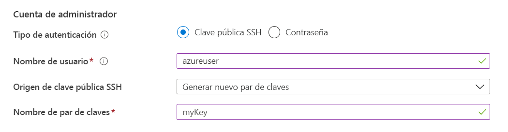
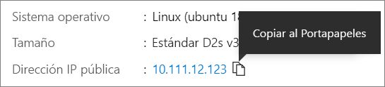

# <a name="quickstart-create-a-linux-virtual-machine-in-the-azure-portal"></a>Inicio rápido: Creación de una máquina virtual Linux en Azure Portal

Las máquinas virtuales de Azure pueden crearse mediante Azure Portal. Azure Portal es una interfaz de usuario basada en explorador para crear recursos de Azure. En este inicio rápido se muestra cómo usar Azure Portal para implementar una máquina virtual Linux en Azure que ejecuta Ubuntu 18.04 LTS. Para ver la máquina virtual en acción, conéctese a ella mediante SSH e instale el servidor web NGINX.

Si no tiene una suscripción a Azure, cree una [cuenta gratuita](https://azure.microsoft.com/free/?WT.mc_id=A261C142F) antes de empezar.

## <a name="sign-in-to-azure"></a>Inicio de sesión en Azure

Inicie sesión en [Azure Portal](https://portal.azure.com) si aún no lo ha hecho.

## <a name="create-virtual-machine"></a>Crear máquina virtual

1. Escriba **máquinas virtuales** en la búsqueda.
1. En **Servicios**, seleccione **Máquinas virtuales**.
1. En la página **Máquinas virtuales**, seleccione **Agregar**. Se abrirá la página **Creación de una máquina virtual**.
1. En la pestaña **Aspectos básicos**, en **Detalles del proyecto**, asegúrese de que esté seleccionada la suscripción correcta y luego elija **Crear nuevo** grupo de recursos. Escriba *myResourceGroup* para el nombre.*. 

    

1. En **Detalles de instancia**, escriba *myVM* en **Nombre de máquina virtual**, elija *Este de EE. UU.* como **Región** y, luego, *Ubuntu 18.04 LTS* como **Imagen**. Deje los demás valores predeterminados.

    

1. En **Cuenta de administrador** , seleccione **Clave pública SSH**.

1. En **Nombre de usuario**, escriba *azureuser*.

1. En **Origen de clave pública SSH**, deje el valor predeterminado **Generar nuevo par de claves** y, a continuación, escriba *myKey* en **Nombre de par de claves**.

    

1. En **Reglas de puerto de entrada** > **Puertos de entrada públicos**, elija **Permitir los puertos seleccionados** y luego seleccione **SSH (22)** y **HTTP (80)** en la lista desplegable. 

    

1. Deje los valores predeterminados restantes y luego seleccione el botón **Revisar + crear** en la parte inferior de la página.

1. En la página **Crear una máquina virtual** verá los detalles de la máquina virtual que va a crear. Cuando esté preparado, seleccione **Crear**.

1. Cuando se abra la ventana **Generar nuevo par de claves**, seleccione **Descargar la clave privada y crear el recurso**. El archivo de clave se descargará como **myKey.pem**. Asegúrese de que sabe dónde se descargó el archivo `.pem`, ya que necesitará la ruta de acceso en el paso siguiente.

1. Cuando la implementación finalice, seleccione **Ir al recurso**.

1. En la página de la nueva máquina virtual, seleccione la dirección IP pública y cópiela en el portapapeles.


    

## <a name="connect-to-virtual-machine"></a>Conexión a la máquina virtual

Cree una conexión SSH con la máquina virtual.

1. Si está en una máquina Mac o Linux, abra un símbolo del sistema de Bash. Si está en una máquina Windows, abra un símbolo del sistema de PowerShell. 

1. En el símbolo del sistema, abra una conexión SSH a la máquina virtual. Reemplace la dirección IP por la de la máquina virtual y reemplace la ruta de acceso al archivo `.pem` por la ruta de acceso a la ubicación en la que se descargó el archivo de clave.

```console
ssh -i .\Downloads\myKey1.pem azureuser@10.111.12.123
```

> [!TIP]
> Ahora la clave SSH que creó se puede usar la próxima vez que cree una máquina virtual en Azure. Solo tiene que seleccionar la opción **Usar la clave existente almacenada en Azure** en **Origen de clave pública SSH** la próxima vez que cree una máquina virtual. Ya dispone de la clave privada en el equipo, por lo que no tendrá que descargar nada.

## <a name="install-web-server"></a>Instalación del servidor web

Para ver la máquina virtual en acción, instale al servidor de web de NGINX. En la sesión de SSH, actualice los orígenes de paquete e instale el paquete NGINX más reciente.

```bash
sudo apt-get -y update
sudo apt-get -y install nginx
```

Cuando haya terminado, escriba `exit` para salir de la sesión de SSH.


## <a name="view-the-web-server-in-action"></a>Visualización del servidor web en acción

Use un explorador web de su elección para ver la página de bienvenida predeterminada de NGINX. Escriba la dirección IP pública de la máquina virtual como dirección web. La dirección IP pública se encuentra en la página de introducción de la máquina virtual o como parte de la cadena de conexión de SSH que usó anteriormente.


## <a name="clean-up-resources"></a>Limpieza de recursos

Cuando ya no los necesite, puede eliminar el grupo de recursos, la máquina virtual y todos los recursos relacionados. Para ello, seleccione el grupo de recursos de la máquina virtual, seleccione **Eliminar** y luego confirme el nombre del grupo de recursos para eliminar.

## <a name="next-steps"></a>Pasos siguientes

En esta guía de inicio rápido, implementó una máquina virtual sencilla, creó un grupo de seguridad de red y una regla e instaló un servidor web básico. Para más información acerca de las máquinas virtuales de Azure, continúe con el tutorial de máquinas virtuales Linux.

> [!div class="nextstepaction"]
> [Tutoriales de máquinas virtuales Linux de Azure](./tutorial-manage-vm.md)
