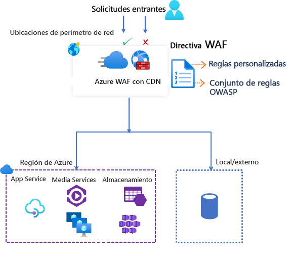

# Firewall de aplicaciones web de Azure en Azure Content Delivery Network

Firewall de aplicaciones web (WAF) en Azure Content Delivery Network (CDN) de Microsoft proporciona protección centralizada para el contenido web. WAF defiende los servicios web frente a vulnerabilidades comunes. Mantiene su servicio de alta disponibilidad para los usuarios y le ayuda a cumplir los requisitos de cumplimiento.

> [!IMPORTANT]
> WAF en Azure CDN de Microsoft se encuentra actualmente en versión preliminar pública y se proporciona con un Acuerdo de Nivel de Servicio de versión preliminar. Es posible que algunas características no sean compatibles o que tengan sus funcionalidades limitadas.  Para más información, consulte [Términos de uso complementarios de las versiones preliminares de Microsoft Azure](https://azure.microsoft.com/support/legal/preview-supplemental-terms/).

WAF en Azure CDN es una solución global y centralizada. Está implementado en ubicaciones de perímetro de red de Azure de todo el mundo. WAF detiene los ataques malintencionados cerca de los orígenes de ataques, antes de que alcancen el origen. El usuario obtiene protección a gran escala sin sacrificar el rendimiento. 

Una directiva WAF se vincula fácilmente a cualquier punto de conexión de CDN de la suscripción. Las nuevas reglas se implementan en cuestión de minutos, por lo que puede responder rápidamente a los cambios en los patrones de amenazas.

## Reglas y directiva de WAF

Puede configurar una directiva WAF y asociarla a uno o varios puntos de conexión de CDN para protegerlos. Una directiva de WAF consta de dos tipos de reglas de seguridad:

- Reglas personalizadas que se pueden crear.

- Conjuntos de reglas administrados que son una colección de reglas configuradas previamente y administradas por Azure.

Cuando ambos están presentes, las reglas personalizadas se procesan antes de procesar las reglas de un conjunto de reglas administrado. Una regla está formada por una condición de coincidencia, una prioridad y una acción. Los tipos de acción que se admiten son los siguientes: *ALLOW*, *BLOCK*, *LOG* y *REDIRECT*. Puede crear una directiva totalmente personalizada que cumpla sus requisitos específicos de protección de aplicaciones al combinar reglas personalizadas y administradas.

Las reglas de una directiva se procesan en un orden de prioridad. La prioridad es un número único que describe el orden de las reglas que se van a procesar. Los números más pequeños indican una prioridad más alta y estas reglas se evalúan antes que las reglas con un valor más largo. Una vez que una regla coincide, la acción correspondiente que se ha definido en la regla se aplica a la solicitud. Cuando se procesa esa coincidencia, ya no se procesan más reglas con prioridades inferiores.

Una aplicación web hospedada en Azure CDN solo puede tener una directiva de WAF asociada a la vez. En cambio, puede tener un punto de conexión de CDN sin ninguna directiva de WAF asociada con él. Si una directiva de WAF está presente, se replica a todas nuestras ubicaciones perimetrales para garantizar que haya coherencia en las directivas de seguridad en todo el mundo.

## Modos de WAF

La directiva WAF se puede configurar para ejecutarse en los siguientes dos modos:

- *Modo de detección*: cuando se ejecuta en el modo de detección, WAF no realiza ninguna acción que no sea supervisar y registrar la solicitud y sus reglas de WAF coincidentes en los registros de WAF. Puede activar los diagnósticos de registro para Azure CDN. Vaya a la sección **Diagnostics** del portal.

- *Modo de prevención*: En el modo de prevención, WAF realiza la acción especificada si una solicitud coincide con una regla. Si se encuentra una coincidencia, no se evalúa ninguna otra regla con prioridad más baja. Todas las solicitudes coincidentes también se registran en los registros de WAF.

## Acciones de WAF

Puede elegir una de las acciones siguientes cuando una solicitud coincide con las condiciones de una regla:

- *Permitir*: la solicitud pasa por WAF y se reenvía al servidor back-end. Ninguna otra regla de prioridad más baja puede bloquear esta solicitud.
- *Bloquear*: la solicitud está bloqueada y WAF envía una respuesta al cliente sin reenviar la solicitud al servidor back-end.
- *Log*:  la solicitud se registra en los registros de WAF y WAF sigue evaluando las reglas de prioridad más baja.
- *Redirect*: WAF redirige la solicitud al URI especificado. El URI especificado es una configuración de nivel de directiva. Una vez configurado, todas las solicitudes que coinciden con la acción *Redirigir* se envían a ese URI.

## Reglas de WAF

Una directiva de WAF puede consistir de dos tipos de reglas de seguridad:

- *Reglas personalizadas*: reglas creadas por el usuario 
- *Conjuntos de reglas administrados*: conjunto de reglas preconfiguradas administradas por Azure

### Reglas personalizadas

Las reglas personalizadas pueden tener reglas de coincidencia y reglas de control de velocidad.

Puede configurar las siguientes reglas de coincidencia personalizadas:

- *Listas de direcciones IP permitidas y de bloqueo:* puede controlar el acceso a las aplicaciones web en función de una lista de direcciones IP de cliente o intervalos de direcciones IP. Se admiten los tipos de direcciones IPv4 e IPv6. Esta lista puede configurarse para bloquear o permitir esas solicitudes en las que la IP de origen coincide con una IP de la lista.

- *Control de acceso basado en la ubicación geográfica*: puede controlar el acceso a las aplicaciones web en función del código de país asociado con la dirección IP de un cliente.

- *Control de acceso basado en los parámetros HTTP*: puede basar las reglas en coincidencias de cadenas en los parámetros de solicitud HTTP/HTTPS.  Por ejemplo, las cadenas de consulta, los argumentos POST, el URI de solicitud, el encabezado de solicitud y el cuerpo de la solicitud.

- *Control de acceso basado en el método de solicitud*: puede basar las reglas en el método de solicitud HTTP de la solicitud. Por ejemplo, GET, PUT o HEAD.

- *Restricción del tamaño*: puede basar las reglas en las longitudes de determinadas partes de una solicitud, como la cadena de consulta, el URI o el cuerpo de la solicitud.

Una regla de control de velocidad limita el tráfico alto de manera anómala de cualquier dirección IP del cliente.

- *Reglas de limitación de frecuencia*: Puede configurar un umbral en función del número de solicitudes web que se permiten de una dirección IP de cliente durante un minuto. Esta regla es distinta de la regla personalizada de permiso o bloqueo basada en la lista de IP que permita o bloquee todas las solicitudes de una dirección IP de cliente. La limitación de velocidad puede combinarse con condiciones de coincidencia adicionales, como la coincidencia de parámetros HTTP(S) para un control granular de la velocidad.

### Conjuntos de reglas administrados por Azure

Los conjuntos de reglas administrados por Azure proporcionan una forma fácil de implementar la protección frente a un conjunto común de amenazas de seguridad. Dado que Azure administra estos conjuntos de reglas, las reglas se actualizan según sea necesario para protegerse frente a nuevas firmas de ataque. El conjunto de reglas predeterminado administrado por Azure incluye reglas frente a las siguientes categorías de amenaza:

- Scripting entre sitios
- Ataques de Java
- Inclusión de archivos locales
- Ataques por inyección de PHP
- Ejecución de comandos remotos
- Inclusión de archivos remotos
- Fijación de sesión
- Protección contra la inyección de código SQL
- Atacantes de protocolo

El número de versión del conjunto de reglas predeterminado se incrementa cuando se agreguen nuevas firmas de ataque al conjunto de reglas.
El conjunto de reglas predeterminado está habilitado de forma predeterminada en el modo de *detección* de las directivas de WAF. Puede deshabilitar o habilitar reglas individuales en el conjunto de reglas predeterminado para satisfacer los requisitos de su aplicación. También puede establecer acciones específicas (ALLOW/BLOCK/REDIRECT/LOG) por regla. La acción predeterminada para el conjunto de reglas predeterminado administradas es *Bloquear*.

Las reglas personalizadas se aplican siempre antes de que se evalúen las reglas del conjunto de reglas predeterminado. Si una solicitud coincide con una regla personalizada, se aplica la acción de la regla correspondiente. La solicitud se bloquea o se pasa por el back-end. No se procesa ninguna otra regla personalizada ni las reglas del conjunto de reglas predeterminado. También puede quitar el conjunto de reglas predeterminado de las directivas de WAF.

## Configuración

Puede configurar e implementar todos los tipos de reglas de WAF mediante Azure Portal, las API REST, las plantillas de Azure Resource Manager y Azure PowerShell.

## Supervisión

La supervisión de WAF con CDN se integra con Azure Monitor para realizar un seguimiento de las alertas y supervisar con facilidad las tendencias del tráfico.

## Pasos siguientes

- [Tutorial: Creación de una directiva WAF para Azure CDN con Azure Portal](waf-cdn-create-portal.md)
