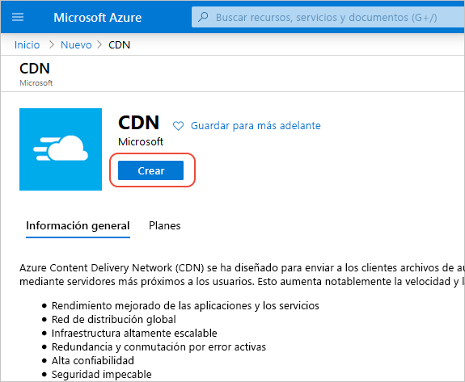
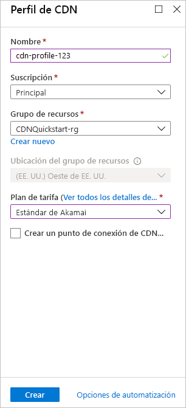

## Crear un nuevo perfil de CDN

Un perfil de CDN es un contenedor para los puntos de conexión de CDN y especifica un plan de tarifa.

1. En Azure Portal, seleccione **Crear un recurso** (en la parte superior izquierda). Aparece el panel **Nuevos**.
   
1. Busque **CDN**, selecciónelo y, después, seleccione **Crear**:
   
    

    Aparece el panel **Perfil de CDN**.

1. Escriba los siguientes valores:
   
    | Configuración  | Value |
    | -------- | ----- |
    | **Nombre** | Escriba *cdn-profile-123* como nombre de perfil. Este nombre debe ser único globalmente; si ya está en uso, escriba otro. |
    | **Suscripción** | Seleccione una suscripción de Azure en la lista desplegable. |
    | **Grupos de recursos** | Seleccione **Crear nuevo** y escriba *CDNQuickstart-rg* como nombre del grupo de recursos, o bien seleccione **Usar existente** y elija *CDNQuickstart-rg* si ya tiene el grupo. | 
    | **Ubicación del grupo de recursos** | Seleccione una ubicación cercana en la lista desplegable. |
    | **Plan de tarifa** | Seleccione la opción **Akamai estándar** en la lista desplegable. (el tiempo de implementación del nivel Akamai es aproximadamente un minuto. El nivel Microsoft tarda aproximadamente 10 minutos y los niveles de Verizon tardan aproximadamente 90 minutos). |
    | **Crear un punto de conexión de CDN ahora** | Déjelo sin seleccionar. |  
   
    

1. Seleccione **Crear** para crear el perfil.

