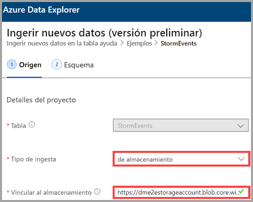
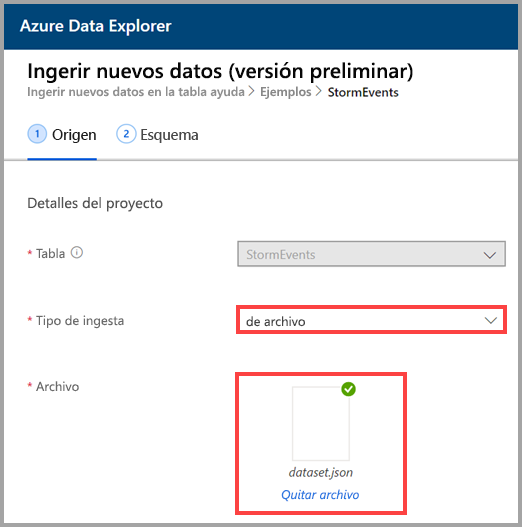
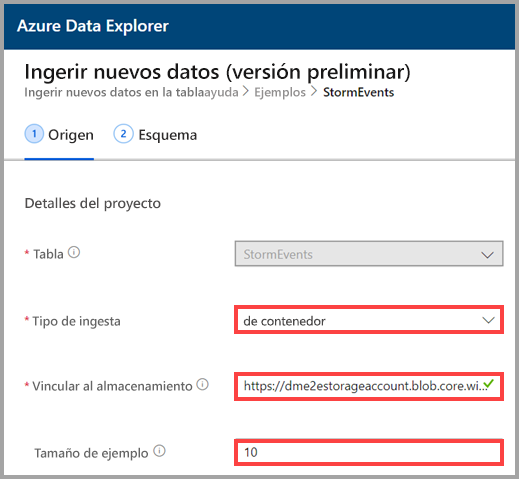

## Selección de un tipo de ingesta

En **Ingestion type** (Tipo de ingesta), seleccione una de las opciones siguientes:
   * **from storage** (de almacenamiento): en el campo **Lin to storage** (Vínculo al almacenamiento), agregue la dirección URL de la cuenta de almacenamiento. Use una [dirección URL de SAS de blob](/azurevs-azure-tools-storage-explorer-blobs#get-the-sas-for-a-blob-container) para las cuentas de almacenamiento privadas.
   
      

    * **from file** (De archivo): seleccione **Browse** (Examinar) para buscar el archivo o bien arrastre el archivo al campo.
  
      

    * **from container** (De contenedor): en el campo **Link to storage** (Vínculo al almacenamiento), agregue la [URL de SAS](/azure/vs-azure-tools-storage-explorer-blobs#get-the-sas-for-a-blob-container) del contenedor y, opcionalmente, especifique el tamaño del ejemplo.

      

  Aparece un ejemplo de los datos. Si lo desea, puede filtrarla para mostrar solo los archivos que empiezan por caracteres específicos. Al ajustar los filtros, la vista previa se actualiza automáticamente.
  
  Por ejemplo, puede filtrar por todos los archivos que comienzan por la palabra *data* y finalizar con una extensión *.csv.gz*.

  
