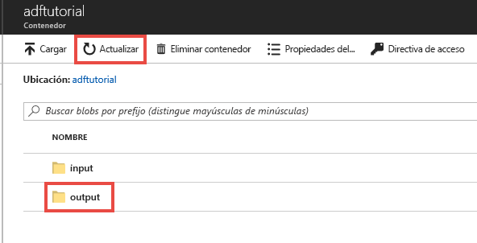
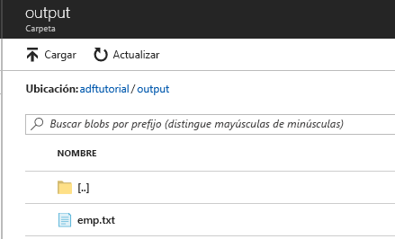

## <a name="review-deployed-resources"></a>Revisión de los recursos implementados

El conducto crea automáticamente la carpeta de salida en el contenedor de blob adftutorial. A continuación, copia el archivo emp.txt de la carpeta de entrada a la carpeta de salida. 

1. En Azure Portal, en la página del contenedor **adftutorial**, seleccione **Actualizar** para ver la carpeta de salida. 
    
    

2. En la lista de carpetas, seleccione **output**. 

3. Confirme que **emp.txt** se ha copiado en la carpeta de salida. 

    

## <a name="clean-up-resources"></a>Limpieza de recursos

Hay dos forma de eliminar los recursos que ha creado en la guía de inicio rápido. Puede eliminar el [grupo de recursos de Azure](../articles/azure-resource-manager/management/overview.md), lo que incluye todos los recursos del grupo de recursos. Si quiere mantener intacto el resto de recursos, elimine solo la factoría de datos que creó en este tutorial.

Al eliminar un grupo de recursos, se eliminan todos los recursos incluidas las factorías de datos. Ejecute el comando siguiente para eliminar el grupo de recursos completo: 

```powershell
Remove-AzResourceGroup -ResourceGroupName $resourcegroupname
```

> [!Note]
> La eliminación de un grupo de recursos puede tardar algún tiempo. Tenga paciencia con el proceso.

Si desea eliminar solo la factoría de datos, no el grupo de recursos completo, ejecute el siguiente comando: 

```powershell
Remove-AzDataFactoryV2 -Name $dataFactoryName -ResourceGroupName $resourceGroupName
```