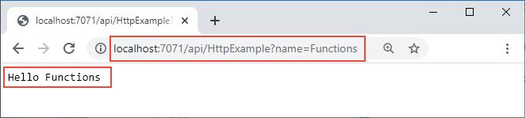

## <a name="run-the-function-locally"></a>Ejecución local de la función

Para ejecutar una función, inicie el host en tiempo de ejecución local de Azure Functions desde la carpeta *LocalFunctionProj*:

::: zone pivot="programming-language-csharp,programming-language-powershell,programming-language-javascript,programming-language-python"
```
func start
```
::: zone-end

::: zone pivot="programming-language-typescript"
```
npm install
npm start
```
::: zone-end

::: zone pivot="programming-language-java"
```
mvn clean package 
mvn azure-functions:run
```
::: zone-end

Hacia el final de la salida, deberían aparecer las líneas siguientes: 

<pre>
...

Now listening on: http://0.0.0.0:7071
Application started. Press Ctrl+C to shut down.

Http Functions:

        HttpExample: [GET,POST] http://localhost:7071/api/HttpExample
...

</pre>

>[!NOTE]  
> Si HttpExample no aparece como se muestra a continuación, es probable que haya iniciado el host desde fuera de la carpeta raíz del proyecto. En ese caso, use **Ctrl**+**C** para detener el host, vaya a la carpeta raíz del proyecto y vuelva a ejecutar el comando anterior.

Copie la dirección URL de la función `HttpExample` de esta salida en un explorador y anexe la cadena de consulta `?name=<your-name>`, lo que hará que la dirección URL completa sea `http://localhost:7071/api/HttpExample?name=Functions`. El explorador debe mostrar un mensaje como este `Hello Functions`:



El terminal en el que inició el proyecto también muestra la salida del registro cuando realiza solicitudes.

Cuando esté listo, presione **Ctrl**+**C** y elija `y` para detener el host de Functions.
