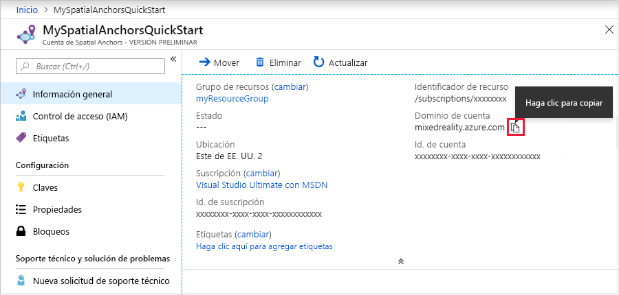

## <a name="create-a-spatial-anchors-resource"></a>Creación de un recurso de Spatial Anchors

### <a name="portal"></a>[Portal](#tab/azure-portal)

Vaya a <a href="https://portal.azure.com" target="_blank">Azure Portal</a>.

En el menú izquierdo, seleccione **Crear un recurso**.

Use el cuadro de búsqueda para buscar **Spatial Anchors**.


Seleccione **Spatial Anchors** y, después, seleccione **Crear**.

En el panel **Cuenta de Spatial Anchors**, haga lo siguiente:

* Escriba un nombre de recurso único con caracteres alfanuméricos normales.  
* Seleccione la suscripción a la que desea asociar el recurso.  
* Cree un grupo de recursos, para lo que debe seleccionar **Crear nuevo**. Asígnele el nombre **myResourceGroup** y luego seleccione **Aceptar**.  

  [!INCLUDE [resource group intro text](resource-group.md)]
  
* Seleccione la ubicación (región) en la que desea colocar el recurso.  
* Seleccione **New** (Nuevo) para empezar a crear el recurso.


Una vez creado el recurso, Azure Portal muestra que se ha completado la implementación. 
   


Haga clic en **Go to resource** (Ir al recurso). Ahora puede ver las propiedades del recurso. 
   
Copie el valor de **Id. de cuenta** del recurso en un editor de texto para usarlo más adelante.


Copie también el valor de **Account Domain** (Dominio de cuenta) del recurso en un editor de texto para usarlo más adelante.



En **Configuración**, seleccione **Clave**. Copie el valor de **Clave principal**, **Clave de cuenta**, en un editor de texto para su uso posterior.


### <a name="azure-cli"></a>[CLI de Azure](#tab/azure-cli)

Empiece por preparar el entorno para la CLI de Azure:

[!INCLUDE [azure-cli-prepare-your-environment-no-header.md](azure-cli-prepare-your-environment-no-header.md)]

1. Después de iniciar sesión, use el comando [az account set](/cli/azure/account#az_account_set) para seleccionar la suscripción en la que desea configurar la cuenta de Spatial Anchors:

   ```azurecli
   az account set --subscription 00000000-0000-0000-0000-000000000000
   ```

1. Ejecute el comando [az group create](/cli/azure/group#az_group_create) para crear un grupo de recursos o use un grupo de recursos existente:

   ```azurecli
   az group create --name myResourceGroup --location eastus2
   ```

   [!INCLUDE [resource group intro text](resource-group.md)]

   Para ver las cuentas de Spatial Anchors actuales de un grupo de recursos, use el comando [az spatial-anchors-account list](/cli/azure/ext/mixed-reality/spatial-anchors-account#ext_mixed_reality_az_spatial_anchors_account_list):

   ```azurecli
   az spatial-anchors-account list --resource-group myResourceGroup
   ```

   También puede ver las cuentas de Spatial Anchors de su suscripción:

   ```azurecli
   az spatial-anchors-account list
   ```

1. Ejecute el comando [az spatial-anchors-account create](/cli/azure/ext/mixed-reality/spatial-anchors-account#ext_mixed_reality_az_spatial_anchors_account_create) para crear su cuenta de Spatial Anchors:

   ```azurecli
   az spatial-anchors-account create --resource-group myResourceGroup --name MySpatialAnchorsQuickStart --location eastus2
   ```

1. Para ver las propiedades de los recursos, use el comando [az spatial-anchors-account show](/cli/azure/ext/mixed-reality/spatial-anchors-account#ext_mixed_reality_az_spatial_anchors_account_show):

   ```azurecli
   az spatial-anchors-account show --resource-group myResourceGroup --name MySpatialAnchorsQuickStart
   ```

   Copie también los valores de **Account ID** (Identificador de cuenta) y **Account Domain** (Dominio de cuenta) del recurso en un editor de texto para usarlo más adelante.

1. Ejecute el comando [az spatial-anchors-account key show](/cli/azure/ext/mixed-reality/spatial-anchors-account/key#ext_mixed_reality_az_spatial_anchors_account_key_show) para obtener sus claves principales y secundarias:

   ```azurecli
   az spatial-anchors-account key show --resource-group myResourceGroup --name MySpatialAnchorsQuickStart
   ```

   Copie los valores de clave en un editor de texto para su posterior uso.

   Si tiene que volver a generar las claves, use el comando [az spatial-anchors-account key renew](/cli/azure/ext/mixed-reality/spatial-anchors-account/key#ext_mixed_reality_az_spatial_anchors_account_key_renew):

   ```azurecli
   az spatial-anchors-account key renew --resource-group myResourceGroup --name example --key primary
   az spatial-anchors-account key renew --resource-group myResourceGroup --name example --key secondary
   ```

Puede eliminar una cuenta mediante el comando [az spatial-anchors-account delete](/cli/azure/ext/mixed-reality/spatial-anchors-account#ext_mixed_reality_az_spatial_anchors_account_delete):

```azurecli
az spatial-anchors-account delete --resource-group myResourceGroup --name MySpatialAnchorsQuickStart
```

---
