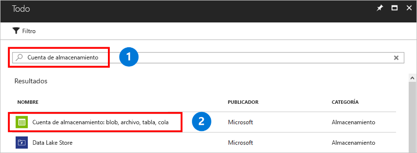

Una cuenta de almacenamiento es un grupo compartido de almacenamiento en el que puede implementar un recurso compartido de archivos de Azure u otros recursos de almacenamiento como blobs o colas. Una cuenta de almacenamiento puede contener un número ilimitado de recursos compartidos. Un recurso compartido puede almacenar un número ilimitado de archivos, hasta los límites de capacidad de la cuenta de almacenamiento.

Para crear una cuenta de almacenamiento:

1. En el menú de la izquierda, seleccione **+** para crear un recurso.
1. En el cuadro de búsqueda, escriba **cuenta de almacenamiento**, seleccione **Storage account - blob, file, table, queue** (Cuenta de almacenamiento: blob, archivo, tabla, cola) y, luego, seleccione **Crear**.
    

1. En **Nombre**, escriba *mystorageacct* seguido de algunos números aleatorios, hasta que aparezca una marca de verificación verde que indica que es un nombre único. Un nombre de cuenta de almacenamiento debe estar en minúsculas y ser único globalmente. Anote el nombre de la cuenta de almacenamiento. Lo usará más adelante. 
1. En **Modelo de implementación**, deje el valor predeterminado de **Resource Manager**. Para más información sobre las diferencias entre Azure Resource Manager y el modelo de implementación clásica, consulte [Modelos de implementación y estado de los recursos](../articles/azure-resource-manager/management/deployment-models.md).
1. En **Rendimiento**, conserve el valor predeterminado de **Estándar**.
    
    > [!NOTE]
    > En este inicio rápido se crea un recurso compartido de archivos estándar, pero si desea usar recursos compartidos de archivos Prémium, seleccione **Premium**.

1. En **Tipo de cuenta**, seleccione **StorageV2**. Para más información sobre los diferentes tipos de cuentas de almacenamiento, consulte [Cuentas de Azure Storage](../articles/storage/common/storage-account-overview.md?toc=%2fazure%2fstorage%2ffiles%2ftoc.json).

    > [!NOTE]
    > En este inicio rápido se crea una cuenta de uso general v2. Si desea usar recursos compartidos de archivos Prémium, seleccione **FileStorage** en su lugar.

1. En **Replicación**, seleccione **Almacenamiento con redundancia local (LRS)** . 
1. En **Se requiere transferencia segura** se recomienda seleccionar siempre **Habilitado**. Para más información sobre esta opción, consulte [Cifrado en tránsito](../articles/storage/common/storage-require-secure-transfer.md?toc=%2fazure%2fstorage%2ffiles%2ftoc.json).
1. En **Suscripción**, seleccione la suscripción que se usó para crear la cuenta de almacenamiento. Si solo tiene una suscripción, debe ser la predeterminada.
1. En **Grupo de recursos**, seleccione **Crear nuevo**. Como nombre, escriba *myResourceGroup*.
1. En **Ubicación**: seleccione **Este de EE. UU**.
1. En **Redes virtuales**, deje la opción predeterminada como **Deshabilitada**. 
1. Seleccione **Anclar al panel** para que la cuenta de almacenamiento sea más fácil de encontrar.
1. Cuando termine, haga clic en **Crear** para iniciar la implementación.