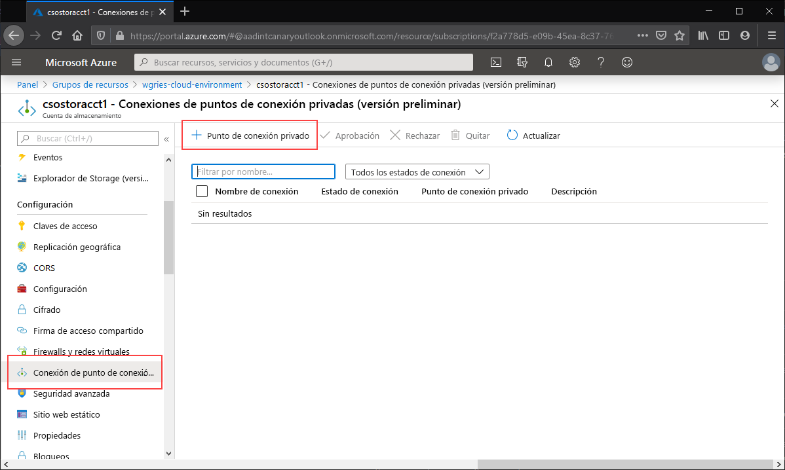
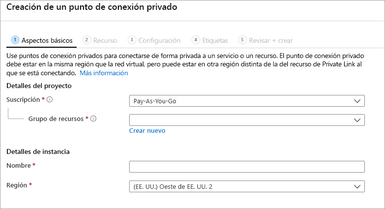
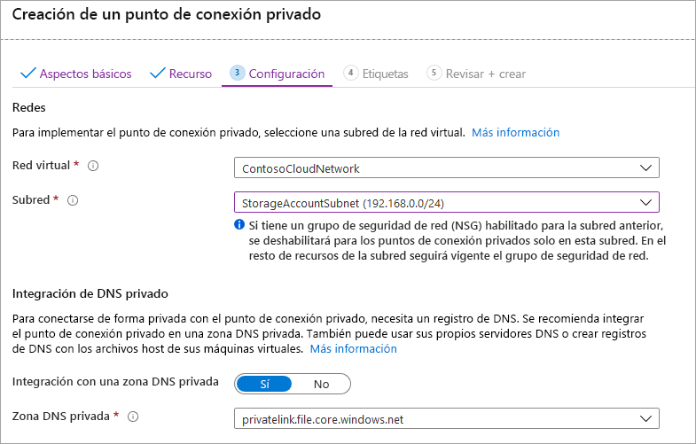

Vaya a la cuenta de almacenamiento para la que desea crear un punto de conexión privado. En la tabla de contenido de la cuenta de almacenamiento, seleccione **Conexiones de punto de conexión privado** y, luego, **+ Punto de conexión privado** para crear un punto de conexión privado. 

El asistente resultante tiene varias páginas que debe completar:

En la hoja **Aspectos básicos**, seleccione el grupo de recursos, el nombre y la región que quiera para el punto de conexión privado. Estos pueden ser cualquier cosa que desee y no tienen que coincidir con la cuenta de almacenamiento en ningún aspecto, aunque debe crear el punto de conexión privado en la misma región que la red virtual en la que quiere crear el punto de conexión privado.

En la hoja **Recurso**, seleccione el botón de radio **Connect to an Azure resource in my directory** (Conectarse a un recurso de Azure en mi directorio). En **Tipo de recurso**, seleccione **Microsoft.Storage/storageAccounts** para el tipo de recurso. El campo **Recurso** es la cuenta de almacenamiento con el recurso compartido de archivos de Azure al que quiere conectarse. El recurso secundario de destino es **archivo**, ya que es para Azure Files.

La hoja **Configuración** permite seleccionar la red virtual y la subred específicas a las que le gustaría agregar el punto de conexión privado. Debe seleccionar una subred distinta de la subred en la que agregó el punto de conexión de servicio anteriormente. La hoja Configuración también contiene la información para crear o actualizar la zona DNS privada. Se recomienda usar la zona `privatelink.file.core.windows.net` predeterminada.

Haga clic en **Revisar y crear** para crear el punto de conexión privado. 
