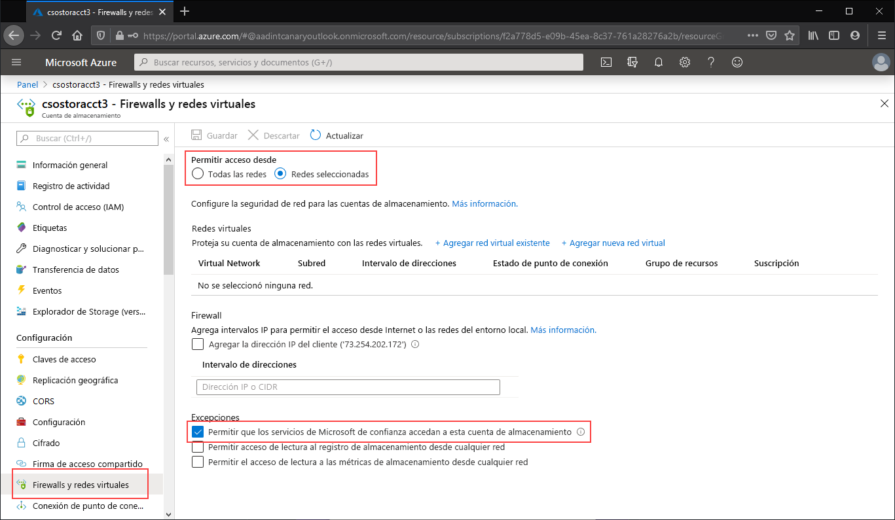

Vaya a la cuenta de almacenamiento para la que desea restringir todo el acceso al punto de conexión público. En la tabla de contenido de la cuenta de almacenamiento, seleccione la entrada **Firewalls y redes virtuales**.

En la parte superior de la página, seleccione el botón de radio **Redes seleccionadas**. Esta acción anulará la ocultación de una serie de opciones para controlar la restricción del punto de conexión público. Active **Allow trusted Microsoft services to access this service account** (Permitir que los servicios de Microsoft de confianza accedan a esta cuenta de servicio) para permitir que servicios de confianza de terceros, como Azure File Sync, accedan a la cuenta de almacenamiento.

